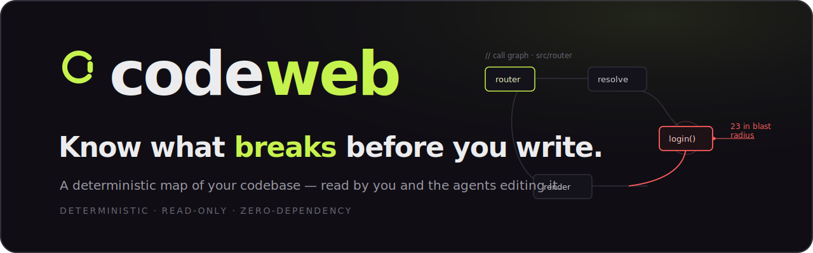
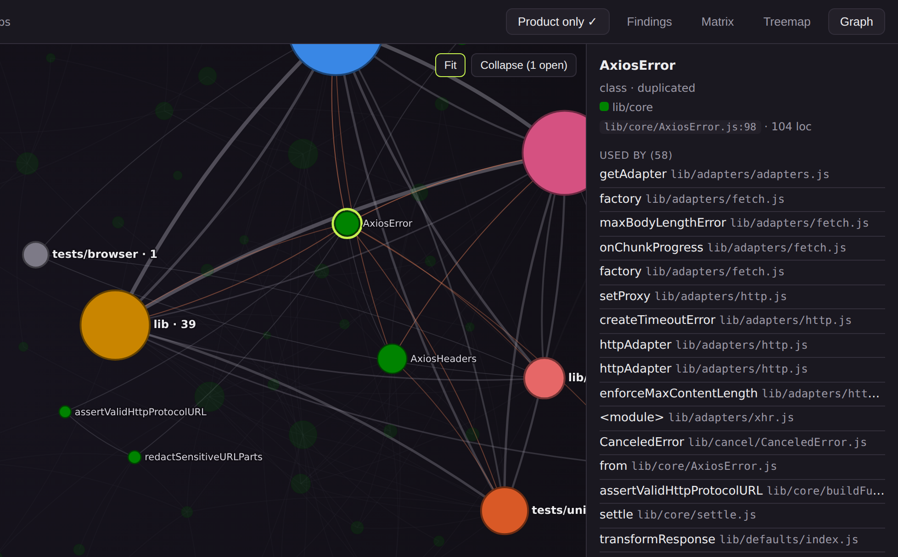
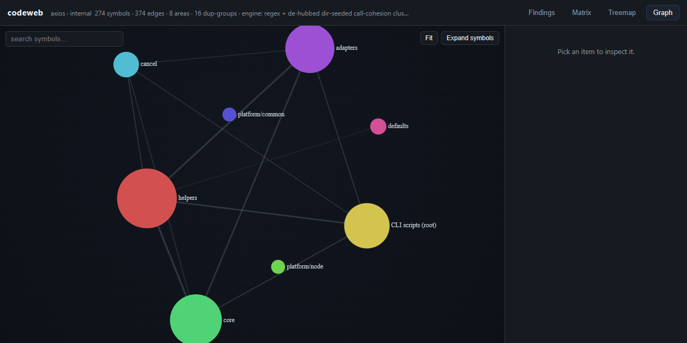
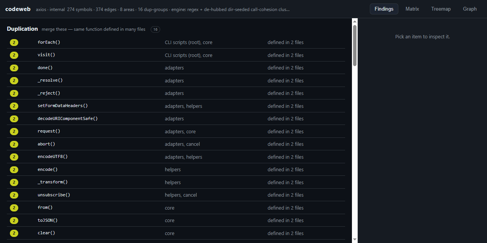
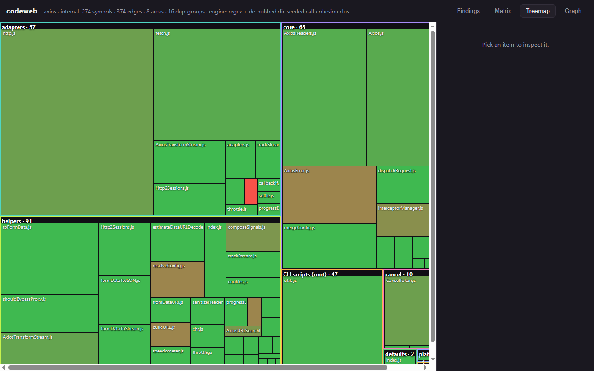
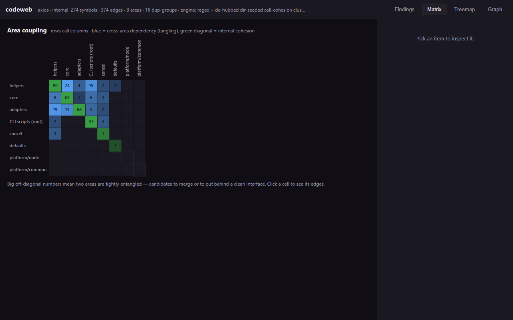
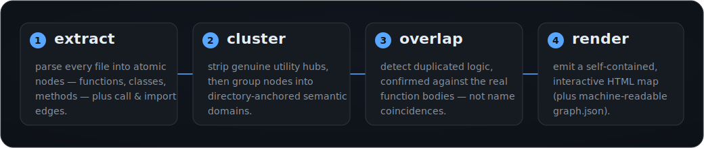

<div align="center">



[](https://github.com/GhostlyGawd/codeweb/actions/workflows/ci.yml)
[](https://www.npmjs.com/package/@ghostlygawd/codeweb)
[](LICENSE)
[](#how-it-works)
[](#use-it-as-an-mcp-tool)
[](https://github.com/sponsors/GhostlyGawd)

**Your coding agent greps. codeweb knows.**

**Free & MIT-licensed. Runs entirely on your machine — no account, no server, no telemetry. Reads your code; never executes it.**
<br><sub>DETERMINISTIC · READ-ONLY · ZERO-DEPENDENCY</sub>

Before you change code, you need answers. **Who calls this? What breaks if I touch it?
Does this already exist? Is this dead?**

Today your coding agent answers by grepping and reading whole files — thousands of tokens per
question, and it still guesses. codeweb reads your repo once (~3 s for 3,000 symbols) and builds
the real call/import graph. After that, every answer is exact, instant, and about a kilobyte.

Your agent gets **27 deterministic tools** it can call over MCP — the open protocol coding agents
like Claude Code, Cursor, and Windsurf use to call tools. No LLM anywhere in codeweb's loop.
You get a self-contained **interactive map** of your codebase. The payoff: edits stop breaking
callers nobody saw, and your agent stops re-implementing code that already exists.

Here's codeweb against grep on [vite](https://github.com/vitejs/vite) (3,000+ symbols), with the
TypeScript compiler as an independent referee ([the receipt](bench/results/oracle-ab.json)):

| The question | codeweb | grep |
|---|---|---|
| *"Who depends on X?"* | Every file the compiler confirms. Fewer wrong matches. **0.7 KB, one call.** | The same files at 3× the tokens — raw text the agent must still read |
| *"What breaks if I change X?"* | **One ~1 KB answer** | No transitive search exists: ~5 rounds of grepping, **126× the tokens** |
| *"Does this already exist? Is this dead? Did my edit break structure?"* | One call each (`find_similar` / `deadcode` / `diff` gate) | Not answerable by search |

Don't take vite's word for it — run the same referee on your own repo:
`npm run bench -- <path>/.codeweb/graph.json`.

And there's a bonus you can see: the map surfaces **duplication, dead code, hotspots, and tangled
domains** — where your codebase does the same work twice, which nobody can see from inside a
single file.

**[Website](https://ghostlygawd.github.io/codeweb/)**&nbsp;·&nbsp;[See it in action](#see-it-in-action)&nbsp;·&nbsp;[Install](#install)&nbsp;·&nbsp;[Use](#use)&nbsp;·&nbsp;[For agents (MCP)](#use-it-as-an-mcp-tool)&nbsp;·&nbsp;[How it works](#how-it-works)&nbsp;·&nbsp;[Changelog](CHANGELOG.md)

</div>

---

## See it in action

One command runs the whole deterministic pipeline and drops an interactive map at
`<target>/.codeweb/report.html`. **Every screenshot below is that actual generated report**, codeweb
pointed read-only at **[axios](https://github.com/axios/axios)** — 274 product symbols across 8
domains (tests and tooling hidden by default). No mockups; regenerate them any time with
`node scripts/screenshot.mjs`.

> **▶ Read the full [axios case study](docs/case-study-axios.md):** on a library downloaded ~50M
> times a week, codeweb body-confirmed **3 real duplications** (two byte-identical across files),
> dismissed 12 false positives, and produced a cycle-safe merge plan for each. Or **[click around
> this exact map yourself](https://ghostlygawd.github.io/codeweb/demo/)** — it's live on GitHub Pages.

### Know what an edit breaks — before you write

That's the whole point. Ask *if I change this function, what else moves?* — and codeweb answers from
structure, not a guess. Click any node in the [living map](https://ghostlygawd.github.io/codeweb/) and
its **blast radius** lights up: every function transitively affected, and the domains it crosses. It's
the `codeweb_impact` tool — the same answer an agent gets over MCP, before it writes a line.

<div align="center">

<br><sub>Selecting <code>AxiosError</code> in axios lights up its <b>58 users across the domains that depend on it</b> — try it yourself in the <a href="https://ghostlygawd.github.io/codeweb/">living map</a>.</sub>
</div>

### Navigate the whole system

A force-directed map of every symbol, collapsible to domains. Search, drag, zoom, and click any
node to trace what depends on it and what it reaches.



### Findings — stop guessing what to refactor

Ranked **duplication** (the same function defined across many files), the most depended-on
**hotspots** to change with care, and likely-**dead code** — every row clickable to inspect what
calls it and what it calls.



### See duplication density, and where domains tangle

<table>
<tr>
<td width="50%" valign="top">

<br><b>Treemap</b> — every file sized by lines of code; the brighter red a block, the more of it
is duplicated. The bright blocks are your consolidation targets, at a glance.
</td>
<td width="50%" valign="top">

<br><b>Matrix</b> — domain-to-domain coupling. A big off-diagonal cell means two domains are
tangled: merge them, or put a clean interface between them.
</td>
</tr>
</table>

<div align="center">

<br><sub>The deterministic pipeline, looping: extract → cluster → overlap → render.</sub>
</div>

---

codeweb works at **symbol resolution** — functions, classes, and methods, and the call/import
edges between them. File-level scanners can tell you two *modules* look alike; codeweb tells you
two *functions* are the same work, who calls each, and what merging them would break.

## Proven effective — measured, not just claimed

We didn't just assert codeweb works. We wrote down 33 specific things it should be able to do
**before** testing — so we couldn't move the goalposts — then tested them against independent
referees. **32 of 33 passed** ([the check-by-check receipt](bench/preregistration.md)). The
short version:

- **Is it right?** We checked codeweb's answers — who calls what, what an edit breaks, where the
  cycles are — against independent referees, **490,000+ times. It was never wrong.** Its
  edit-safety checks held across another 20,000 trials, zero violations.
- **Does it find real duplication?** On the labeled benchmark it found **every planted clone with
  zero false alarms** (F1 1.0; name-matching scores 0.67). Rename the copies and it still finds
  them all — text-matching tools find none. Asked *"what should I reuse here?"*, the right answer
  ranked first almost every time (MRR 0.99).
- **Does it scale?** In our corpus, mapping a repo **twice the size took only ~26% longer**
  (measured exponent 0.33). On a 3,201-symbol graph, answers come back in **about a tenth of a
  second**. And it runs on an empty `node_modules` — zero required dependencies.
- **Does it actually help an agent?** Asked to find every place a function is used — the step
  before changing it safely — an agent using grep found **44%** of them. The same agent using
  codeweb found **74%**, on the same context budget, in all 5 runs
  ([receipt](bench/experiments/efficiency-pilot.reps5-v090.json)). Every caller the agent misses
  is a caller its edit can break. (An earlier run on a different base model also showed big token
  savings; that part did not replicate, and we say so rather than quoting the better number.)
- **Where does it fall short?** Two honest results. Re-mapping after very heavy edits isn't as
  fast as we wanted (the measured curve is published). And on simple, clean tasks, agents edited
  fine with or without codeweb — no measurable quality lift there. The study also found and fixed
  two real engine bugs the test suite had missed.

> **▶ Every number above has a receipt — see the [evidence ledger](https://ghostlygawd.github.io/codeweb/research.html).**
> Raw results live in [`bench/`](bench/); every number regenerates with `node bench/run-all.mjs`.
> CI re-measures the standing performance budgets on every PR
> ([`bench/budgets.json`](bench/budgets.json)) — a change that breaks a published number fails
> the build.

The value codeweb delivers during real work is counted where it accrues: a strictly-local outcome
ledger (`npm run stats`, surfaced in every session brief) prints a receipt shaped like:

```
codeweb this month: 41 pre-edit card(s) · 5 card-named caller(s) followed · 2 regression(s) flagged · 120 queries served
```

## Two modes

- **Internal** — map your own codebase and find consolidation opportunities to restructure.
- **External** — clone a third-party repo *read-only* (e.g. a Claude Code plugin you found on
  GitHub), fully map it, and get an adoption review before you commit to using it. codeweb
  never executes target code.

## Install

**Free & MIT-licensed. Runs entirely on your machine — no account, no server, no telemetry. Reads
your code; never executes it.** Zero required dependencies — it runs on an empty `node_modules`
(CI-verified); you need **Node.js ≥ 22**. One *optional* wasm grammar (`web-tree-sitter`) sharpens
extraction when present and is never required. Releases are published from CI with **npm provenance**
— verify any install with `npm audit signatures`.

**Using Claude Code?** The plugin adds the `/codeweb` command, ambient pre-edit impact cards, and
all 27 tools:
```
/plugin marketplace add GhostlyGawd/codeweb
/plugin install codeweb
```
Then restart Claude Code so the `/codeweb` command, agents, and skill register.

**Using Cursor, Windsurf, or another MCP agent?** Register the same zero-dependency stdio server
(shown with Claude Code's syntax — swap in your client's add-server command):
```
claude mcp add codeweb -- npx -y -p @ghostlygawd/codeweb codeweb-mcp
```

**Just want the map — no AI involved?** One command, from your project directory:
```
cd your-project
npx -y @ghostlygawd/codeweb .    # ~3 s for 3,000 symbols — then open .codeweb/report.html
```

*Not sure? Run the npx one-liner — it's the whole map, no install, nothing to undo.*

**Or run the engine from a clone:**
```
git clone https://github.com/GhostlyGawd/codeweb.git
node codeweb/scripts/run.mjs /path/to/your/project   # map lands in /path/to/your/project/.codeweb
# no-stakes test drive: point it at any repo you already have checked out (read-only, seconds):
node codeweb/scripts/run.mjs /path/to/any/checkout --out-dir /tmp/test-map
# (the bench corpus is NOT bundled — bench/corpus/clone-corpus.sh fetches it, for benchmark work)
```

Requires **Node.js ≥ 22** — the whole deterministic pipeline (extract → cluster → overlap → render)
runs on Node, no external dependencies. Every bin, flag, environment variable, and exit code is
tabled in [`docs/cli.md`](docs/cli.md). Static-analysis tools (universal-ctags, ripgrep, madge,
etc.) are *optional* — they only sharpen the agent fallback path; the default engine reads the code
directly.

**In your editor:** [`editor/vscode-codeweb`](editor/vscode-codeweb/) is a zero-dependency VS Code
extension that shows **`N callers · blast M`** CodeLens above every mapped symbol (served from the
nearest `.codeweb/graph.json`, same numbers as `codeweb_callers`/`codeweb_impact`), with
click-through into the interactive report.

## What you can do — three jobs

Everything below serves one of three jobs. Skim for yours; each section carries the full flags.

- **Know before you edit** — who calls this, what breaks, does this already exist: `impact`,
  `context-pack`, `find`, `find-similar`, and the ambient pre-edit card.
- **Gate every edit** — the structural regression verdict on edits, PRs, and architecture rules:
  `diff`, `ci-gate`, `review`, `fitness`, and the post-edit hook.
- **Clean up, ranked** — consolidation and dead-code work ordered by evidence: `optimize`,
  `deadcode`, `hotspots`, `campaign`, `trend`.

## Use

```
/codeweb                                  # map the current project
/codeweb src/payments --depth symbol      # deep-dive one subsystem
/codeweb https://github.com/owner/repo    # external review before adopting
/codeweb owner/repo --open                # clone, map, and open the report
```

Flags: `--depth module|symbol|auto`, `--engine hybrid|read|tools`, `--focus <glob>`,
`--mode internal|external`, `--open`. See `commands/codeweb.md`.

## Outputs (under `<target>/.codeweb/`)

| File | What it is |
|---|---|
| `graph.json` | The machine-readable web: `nodes`, `edges`, `domains`, `overlaps`, plus `meta` (target root, engine, languages, stats). |
| `report.html` | Self-contained interactive map — force-directed graph, domain tree, clickable node details, ranked overlap tab. No network/CDN required. |
| `report.md` | The same map as plain markdown — domains, top nodes, ranked overlaps. |
| `overlap.md` | The ranked consolidation opportunities in plain markdown. |
| `optimize.md` | The consolidation advisory — duplicate-logic findings tiered **ready / blocked / review**, each pre-flighted against the gate's cycle check (the `optimize.mjs` report). |
| `fragment.json` | The raw extractor output (atomic nodes + edges) before clustering — the pipeline's first stage. |

## Query the graph (for agents & humans)

Once `graph.json` exists, `scripts/query.mjs` answers the structural questions an agent needs
before it edits — read-only, deterministic, no LLM in the loop:

```
node scripts/query.mjs <graph.json> --impact  <symbol>   # blast radius: transitive callers + domains touched
node scripts/query.mjs <graph.json> --callers <symbol>   # direct callers
node scripts/query.mjs <graph.json> --callees <symbol>   # direct callees
node scripts/query.mjs <graph.json> --cycles             # file-level dependency cycles (SCCs)
node scripts/query.mjs <graph.json> --orphans            # uncalled & unexported (dead-code candidates)
```

`<symbol>` is a node id (`file:label`) or a bare label (a label matching several nodes operates on
the union, reported in `matched`). Add `--json` for stable, machine-readable output. Exit codes:
`0` success (even when empty), `1` symbol not found, `2` usage/IO error. Example — *"what could I
break if I change the state store?"*:

```
$ node scripts/query.mjs .codeweb/graph.json --impact lib/state-store/index.js:get
impact of lib/state-store/index.js:get: 120 functions across 12 domains
```

> `--orphans` is a *candidate* list: codeweb prefers a missing edge to an invented one, so
> genuinely-called functions and entrypoints can surface here — cross-check before deleting.

## Guard agent edits (`diff`)

`scripts/diff.mjs` compares two `graph.json` snapshots (before vs after an edit) and flags
structural **regressions**, so it can run as a PostToolUse hook or CI gate:

```
node scripts/diff.mjs <before.json> <after.json> [--json]
```

It **exits 1** when an edit introduces a new dependency cycle, a new duplication finding, or makes
an existing symbol lose all its callers. It **exits 0** for pure removals — deleting code is an
improvement, not a regression. A brand-new uncalled function is reported but doesn't trip the gate,
because agents add functions before wiring them up.

## Gate every PR (GitHub Action)

`scripts/ci-gate.mjs` turns the `diff` gate into CI: it builds the graph for the PR base and head and
**fails the build on a structural regression** (a new cycle, a new duplication, or a non-exported
symbol that loses every caller — the edit-time preflights are stricter and flag exported ones too).
Drop it into any repo (full spec: [`docs/ci-gate.md`](docs/ci-gate.md)):

```yaml
# .github/workflows/codeweb-gate.yml
on: pull_request
jobs:
  gate:
    runs-on: ubuntu-latest
    steps:
      - uses: actions/checkout@v4
        with: { fetch-depth: 0 }   # required — the gate diffs against the PR base
      - uses: GhostlyGawd/codeweb/.github/actions/codeweb-gate@main
        with: { target: src, comment: true }   # comment posts the structural review on the PR
```

Locally: `node scripts/ci-gate.mjs --base <ref> [--target <subdir>]`. Pure removals never trip the
gate; a brand-new uncalled function is reported but doesn't fail the build.

## Advise consolidations (`optimize.mjs`)

Where `diff.mjs` *gates* (pass/fail on an edit), `optimize.mjs` *advises*: it reads a graph's
body-confirmed `overlaps[]` and ranks the `duplicate-logic` findings into consolidation
opportunities, **pre-flighting each proposed merge against the gate's own cycle check** — without
editing a line of source.

```
node scripts/optimize.mjs <graph.json> [--json]   # or set CODEWEB_WS
```

Each opportunity lands in one of three tiers:

- **ready** — the copies match, and the simulated merge passes the gate. Safe to apply.
- **blocked** — the naive merge would create a new dependency cycle. Needs a neutral home first.
- **review** — the copies have drifted, or confidence is structural-only. A human (or agent) decides.

For each merge it names the surviving copy and reports what gets removed, which callers get
rewired, and the lines reclaimed. It is **advisory only** — it never writes code; applying the
merge stays a human + gate decision.

## Track duplication over time (`trend.mjs`)

A one-shot map tells you where you are; `trend.mjs` tells you which way you're heading — is the
codebase consolidating or sprawling? It charts **body-confirmed duplication** and **cross-domain
coupling** across snapshots, with a sparkline and a rising/falling verdict:

```
node scripts/trend.mjs --git <repo> --last 10 [--focus <subdir>] [--json]   # snapshot the last N commits
node scripts/trend.mjs a.json b.json c.json [--labels …] [--json]           # or chart pre-built snapshots
```

The `--git` mode checks out each of the last N commits into an **ephemeral worktree** (read-only
over your working tree), runs the deterministic pipeline, and records the metrics — so you can watch
duplication trend down as you consolidate, or catch it creeping up in review.

## Find the hotspots — where to refactor first (`hotspots.mjs`)

In a large repo the first question is *where do I even start?* `hotspots.mjs` ranks every symbol by
**complexity × fan-in × churn** — the riskiest, most-depended-on, most-churned code first.
Complexity comes free from the body scan; churn is optional (`--git`, or `--churn <map.json>`).

```
$ node scripts/hotspots.mjs <graph.json>
codeweb hotspots: axios/lib — 253 symbol(s) ranked by complexity x fan-in x churn
  weights: complexity 0.5, fanIn 0.3, churn 0.2
  0.533  adapters/fetch.js:factory  [cx 147 in 1 churn 0]
  0.347  adapters/http.js:httpAdapter  [cx 102 in 0 churn 0]
  0.312  core/mergeConfig.js:mergeConfig  [cx 33 in 6 churn 0]
  0.270  helpers/toFormData.js:toFormData  [cx 50 in 3 churn 0]
```

Every row shows its raw components, so the ranking is auditable rather than a black box. Add `--json`
for machine output; also surfaced as the `codeweb_hotspots` MCP tool.

## Plan a whole optimization campaign (`campaign.mjs`)

`optimize` (ready merges), `deadcode` (safe deletes), and `break-cycles` (verified cuts) are three
separate advisors. `campaign.mjs` composes them into **one ordered, ROI-ranked worklist**. Every
step is pre-flighted, and the ordering matters: applying the steps in sequence never introduces a
cycle that wasn't there before. The plan itself is read-only — codeweb never writes source; the
agent (plus the gate) executes each step.

```
$ node scripts/campaign.mjs <graph.json>
codeweb campaign: axios/lib — 80 step(s): 2 cut, 77 delete, 1 merge
  projected: -12 LOC, 2 cycle(s) broken (all steps stay gate-green in order)
  [DELETE] adapters/fetch.js:duplex  (roi 0; +0 LOC, +0 cycle; cumulative -0 LOC)
  …each of 80 steps tagged [CUT|DELETE|MERGE] with its own gate verdict + cumulative delta
```

`--budget N` keeps the top-N ROI prefix; `--json` emits per-step `{op, gate:{ok}, delta, cumulative,
roi}`. Also surfaced as `codeweb_campaign`.

## Onboard in dependency order (`reading-order.mjs`)

To understand a codebase — or one domain — fast, `reading-order.mjs` emits a **foundations-first**
reading path: the depended-upon leaves before the orchestrators that call them, bounded to a budget.
A curated tour instead of blind grep.

```
$ node scripts/reading-order.mjs <graph.json> --budget 6
codeweb reading-order: 6 symbol(s) — read top-down (foundations first):
    1. core/AxiosError.js:AxiosError
        foundation — 18 in-scope caller(s)
    2. cancel/CanceledError.js:CanceledError
        foundation — 5 in-scope caller(s)
    …
```

Scope it with `--scope domain|file|symbol <value>`; cycles degrade gracefully (members ordered by
fan-in, never a crash). Deterministic and read-only; also the `codeweb_reading_order` MCP tool.

## Measured coverage — "is this symbol actually tested?" (`coverage.mjs`)

`codeweb_tests` answers from test-kind call edges (a heuristic). Feed codeweb a real coverage
report and the answers become **measured**:

```
node --test --experimental-test-coverage --test-reporter=lcov > lcov.info   # Node's own runner
node scripts/coverage.mjs .codeweb/graph.json lcov.info                      # or a c8/istanbul JSON
```

Every instrumented symbol gets `covered`/`hits` facts. From then on, `explain`, `--tests`, and
`context-pack` answers say `covered by the recorded run (peak N hits)` — or, the loud one,
`⚠ NOT covered by the recorded test run` — before an agent edits an unguarded symbol. The whole
feature is optional: without a coverage input, graphs are byte-identical to before.

## Agent tools — context & pre-flight (`context-pack`, `simulate-edit`)

Two read-only tools that move work off the LLM and into the graph (full spec:
[`docs/agent-tools.md`](docs/agent-tools.md)):

```
node scripts/context-pack.mjs  <graph.json> <symbol> [--json]   # minimal context to edit <symbol>
node scripts/simulate-edit.mjs <graph.json> --delete <sym> | --merge <a,b> [--into <id>] | --move <sym> --to <file>
```

`context-pack` returns everything an agent needs to edit one symbol — its body, its direct callers
with their call sites, its callees, and the transitive impact set — so the agent works from a small
window instead of reading whole files. `simulate-edit` predicts the regression gate's verdict for a
hypothetical delete, merge, or move **without performing it**, so doomed edits are discarded before
any code is written. Both share the same graph primitives as `optimize.mjs` (one truth), pinned by
property tests against an independent reference implementation.

## Agent capability suite (write · review · optimize)

A set of read-only, deterministic tools that make an agent better at the three jobs — each pinned by
property tests against an independent reference implementation
(full spec: [`docs/agent-tools-v2.md`](docs/agent-tools-v2.md)):

| Tool | Job | What it answers |
|---|---|---|
| `find-similar.mjs <graph> --body/--stdin/--signature [--structural]` | **write** | "Does code like this already exist?" — ranks existing bodies by similarity to a candidate; `--structural` also catches renamed (Type-2) clones. Reuse instead of re-implementing. |
| `placement.mjs <graph> --calls <ids>` | **write** | Where a new symbol belongs (domain + file by callee gravity) and whether it duplicates something. |
| `query.mjs <graph> --tests <symbol>` | **write** | The tests that exercise a symbol — run the right subset after an edit. |
| `review.mjs <graph> --changed <files> [--before g] [--gate]` | **review** | Maps a change to its changed symbols, blast radius, domains, and a fan-in-ranked review order; structural regression gate. |
| `fitness.mjs <graph> --rules codeweb.rules.json` | **review** | Checks architectural invariants (forbidden deps, layering, no-cycles, fan-in/loc caps); fails on violation. |
| `risk.mjs <graph> [--changed] [--churn/--git]` | **review** | Ranks symbols by change-risk (fan-in × fan-out × loc × blast × churn) for triage. |
| `codemod.mjs <graph> --merge <ids> --into <id> [--write]` | **optimize** | Plans a consolidation merge (deletions + caller rewrites + projected gate); `--write` applies it, gated + reversible. |
| `break-cycles.mjs <graph>` | **optimize** | For each dependency cycle, the cheapest edge to sever — *verified* to break it. |
| `deadcode.mjs <graph>` | **optimize** | Tiers orphans into safe-to-delete vs review-first (test-guarded / entrypoint-like). |
| `annotate.mjs --suppress <fingerprint> [--note …]` | **review** | Records a false-positive suppression in `.codeweb/annotations.json` (never touches source); `overlap`/`deadcode` then hide that finding and report a `suppressedCount`. Fingerprints are identity-based, so a genuinely *new* issue can't hide behind an old suppression. |

Plus **graph freshness**: `refresh.mjs <graph>` re-extracts a graph from disk so mid-edit queries
stay accurate, and the extractor's cache re-scans only changed files (a full rebuild is
byte-identical to the incremental one). Edges from test files carry a distinct `test` kind, so
production `--callers` answers exclude tests. All of the above are also exposed over MCP (below).

## Use it as an MCP tool

`scripts/mcp-server.mjs` is a zero-dependency MCP (Model Context Protocol) stdio server exposing
all **27** of codeweb's tools to any MCP client. In the order an agent meets them:

- **Orient** — `codeweb_map` builds the graph; `codeweb_brief` is the day-one repo page (call it
  first); `codeweb_find` turns free text like *"retry backoff"* into ranked starting symbols.
- **Read the structure** — `codeweb_callers`, `callees`, `impact`, `cycles`, `orphans`, `tests`,
  and `explain` (one symbol, everything known about it).
- **Before writing** — `codeweb_find_similar` (does this already exist?), `placement` (where does
  a new symbol belong?), `context` (the minimal window needed to edit a symbol).
- **Gate the edit** — `codeweb_simulate` (the gate's verdict for a delete/merge/move, before any
  edit), then `refresh` + `diff` after it; `review`, `fitness`, and `risk` for PR time.
- **Clean up** — `codeweb_hotspots`, `deadcode`, `break_cycles`, `campaign`, `reading_order`,
  `codemod` (plan-only over MCP — `--write` is not exposed).
- **Housekeeping** — `codeweb_annotate` (false-positive suppressions, kept in a sidecar, never in
  source) and `codeweb_stats` (the local value receipt).

**Installing the plugin registers the server automatically** (`.claude-plugin/plugin.json` carries
the `mcpServers` entry). Standalone — without the plugin — register it from npm (or a clone):

```
claude mcp add codeweb -- npx -y -p @ghostlygawd/codeweb codeweb-mcp
claude mcp add codeweb -- node /abs/path/to/codeweb/scripts/mcp-server.mjs   # clone variant
```

or in an `.mcp.json`:

```json
{ "mcpServers": { "codeweb": { "command": "node", "args": ["/abs/path/to/codeweb/scripts/mcp-server.mjs"] } } }
```

Built for agents, not just reachable by them:

- **`graph` is optional everywhere** — the server resolves the nearest `.codeweb/graph.json` above
  its cwd (or `CODEWEB_WS`). No graph yet? The error names `codeweb_map`, which builds one (~3s for
  a 3k-symbol repo) without leaving MCP.
- **Budgeted responses by default** — list-heavy tools answer with a one-line `summary`, the top-N
  most relevant items, TRUE totals, and an explicit `more.remaining`; `full: true` (or
  `limit`/`offset`) overrides. A `codeweb_context` that used to weigh ~300KB on a busy symbol now
  answers in ~10KB of call-site windows.
- **Staleness awareness** — when the graph no longer matches disk, query results say so and point
  at `codeweb_refresh`.
- The handshake carries `instructions` teaching the loop: *context → edit → refresh → diff-gate*.

## How it works

For JavaScript, TypeScript, Python, Rust, Go, Java, C#, Ruby, PHP, Kotlin, and Swift the default is a **deterministic Node pipeline** — one
command, no LLM in the loop, reproducible byte-for-byte. `scripts/run.mjs` chains five stages
into a per-target workspace:

<div align="center">

</div>

1. **Extract** (`extract-symbols.mjs`) — parse every source file into atomic nodes (functions,
   classes, methods) and call/import edges. When a bare call could belong to several definitions,
   codeweb drops the edge rather than fabricate a false hub — it prefers a missing edge to an
   invented one. Per-file caching keeps re-extraction incremental, byte-identical to a full rebuild.
2. **Cluster** (`cluster3.mjs`) — strip genuine utility hubs, then group nodes into
   directory-anchored semantic domains.
3. **Overlap** (`overlap.mjs`) — detect duplicated logic and parallel implementations, then
   confirm each candidate against the real function bodies (token-shingle similarity) so findings
   are body-backed, not name coincidences. A structural pass over identifier-normalized *skeletons*
   also catches renamed (Type-2) clones (`find-similar --structural`).
4. **Render** (`build-report.mjs`) — turn `graph.json` into the self-contained `report.html`
   (and `report.md`).

For languages the extractor can't parse (or when the deterministic engine is skipped entirely), codeweb **falls back** to the
agent path: parallel `codeweb-dissector` agents extract nodes + edges per subsystem, the
fragments merge into one graph by node id, and `codeweb-domain-mapper` tags domains and detects
overlaps. Both paths emit the same `graph.json` schema, so clustering, overlap, and rendering are
shared. In **external** mode, either path appends an adoption verdict (risk, deps, architecture).

## Components

```
codeweb/
├── .claude-plugin/plugin.json
├── commands/codeweb.md              # /codeweb trigger
├── scripts/                         # the deterministic engine (default fast path)
│   ├── run.mjs                      # orchestrator — one command, runs all stages per target
│   ├── extract-symbols.mjs         # stage 1: source -> atomic nodes + edges (JS/TS/Python/Rust/Go)
│   ├── cluster3.mjs                # stage 2: hub-strip + directory-anchored domains
│   ├── overlap.mjs                 # stage 3: body-confirmed duplication/overlap detection
│   ├── build-report.mjs            # stage 4: graph.json -> interactive report.html + report.md
│   ├── report-template.html        # the renderer's self-contained HTML shell
│   ├── query.mjs                   # structural queries (callers/callees/tests/impact/cycles/orphans)
│   ├── diff.mjs                    # graph-delta / post-edit regression gate (before vs after)
│   ├── trend.mjs                   # duplication + coupling over snapshots / git history (dashboard)
│   ├── ci-gate.mjs                 # CI gate: before(base)-vs-after(working tree) diff, exits 1 on regression
│   ├── optimize.mjs                # advise: rank body-confirmed dups into gated consolidation opportunities
│   ├── context-pack.mjs            # agent context: blast-radius-scoped window to edit a symbol
│   ├── simulate-edit.mjs           # agent pre-flight: predict the gate's verdict for delete/merge/move
│   ├── refresh.mjs                 # F0: re-extract a graph's nodes+edges from disk (cached, fast)
│   ├── find-similar.mjs            # F1: rank existing bodies vs a candidate (reuse-at-write-time)
│   ├── placement.mjs               # F2: suggest a new symbol's domain/file + reuse warnings
│   ├── review.mjs                  # F5: structural review of a change (blast radius, regressions)
│   ├── fitness.mjs                 # F6: architectural fitness-rule checker
│   ├── risk.mjs                    # F7: change-risk ranking for review triage
│   ├── codemod.mjs                 # F8: consolidation edit plan (+ gated/reversible --write)
│   ├── deadcode.mjs                # F10: confidence-tiered dead-code workflow
│   ├── break-cycles.mjs            # F9: cheapest verified cut per dependency cycle
│   ├── hotspots.mjs                # rank symbols by complexity x fan-in x churn (where to refactor first)
│   ├── campaign.mjs                # compose optimize+deadcode+break-cycles into one gated ROI worklist
│   ├── reading-order.mjs           # foundations-first reading path for onboarding (bounded by budget)
│   ├── annotate.mjs                # record false-positive suppressions in .codeweb/annotations.json
│   ├── mcp-server.mjs              # MCP stdio server exposing all queries + the capability suite
│   └── lib/
│       ├── graph-ops.mjs           # shared pure graph primitives (index, cycles, orphans, impact, reviewImpact, …)
│       ├── shingles.mjs            # F1: shared token-shingle/jaccard (also used by overlap.mjs)
│       ├── skeleton.mjs            # identifier-normalized skeleton for Type-2 (renamed) clone detection
│       ├── complexity.mjs          # cyclomatic complexity + nesting depth (the hotspot inputs)
│       ├── dup-check.mjs           # incremental duplication check over changed symbols (edit gate)
│       ├── annotations.mjs         # finding fingerprints + false-positive suppression memory
│       ├── hotspots.mjs            # the complexity x fan-in x churn blend (shared with tests)
│       ├── campaign.mjs            # the ordered/gated/ROI campaign planner (pure)
│       ├── reading-order.mjs       # foundations-first DAG linearization
│       └── risk.mjs                # F7: the change-risk formula + weights (one truth)
├── agents/                          # fallback path (unparseable langs / no deterministic engine)
│   ├── codeweb-dissector.md         # atomic dissection (parallel, read-only)
│   └── codeweb-domain-mapper.md     # domain tagging + overlap detection
├── skills/codebase-anatomy/
│   ├── SKILL.md                     # orchestration brain (fast path default, agents fallback)
│   └── references/
│       ├── graph-schema.md
│       ├── overlap-heuristics.md
│       └── engine-detection.md
├── assets/                          # brand art (logo, hero, animated demo) + report screenshots
└── README.md
```

## Roadmap

- **More first-class languages** — eleven native today (JavaScript, TypeScript, Python, **Rust**,
  **Go**, **Java**, **C#**, **Ruby**, **PHP**, **Kotlin**, **Swift**); anything else routes through
  the agent fallback. Dynamic-dispatch AST tiers cover JS/TS, Java, C#, Python, Go, Rust, **Ruby**,
  and **PHP**; Kotlin/Swift dispatch waits on a trusted wasm grammar at our pinned ABI
  (recorded in `scripts/grammars/PROVENANCE.md`).

_Recently shipped: the agent-intelligence suite (**hotspots**, **campaign**, **reading-order**,
Type-2 clone detection, suppression memory — 27 tools today) · a
**[live interactive demo](https://ghostlygawd.github.io/codeweb/demo/)** · Go and Rust on the fast
path · duplication-over-time trend · the one-command CI regression gate + GitHub Action._

## Versioning & releases

codeweb follows [Semantic Versioning](https://semver.org/) and keeps a
[Keep a Changelog](https://keepachangelog.com/)-formatted [`CHANGELOG.md`](CHANGELOG.md). Every
capability, benchmark, and fix is recorded there and ships as a **tagged GitHub release**.

One source of truth keeps it honest: the version lives in `package.json`, the MCP tool count in
`scripts/mcp-server.mjs`. Everything else is derived and verified:

```bash
npm run version-sync        # propagate version + tool count -> plugin.json, SKILL.md, README badge
npm run check-consistency   # fail if any public-facing surface has drifted
npm run build:site          # regenerate the docs/ website (zero-dependency, deterministic)
npm run release -- --minor  # roll the changelog, bump, sync, rebuild; prints the git/tag steps
```

`check-consistency` runs in CI and applies codeweb's own "fail on regression" philosophy to its
public copy. It gates version strings on every surface, every prose mention of the tool and
language counts (README, site, skill, npm description), the CHANGELOG entry for the current
version, and the existence of every evidence file the ledger cites.

## About

Built by [GhostlyGawd](https://github.com/GhostlyGawd). Much of the code was written with AI
agents; the commit co-author trailers say which. Issues and questions welcome. Security
reporting: [`SECURITY.md`](SECURITY.md).

**Stay current:** codeweb never phones home. To hear about new versions, watch Releases on
GitHub (**Watch → Custom → Releases**).

## Support the project

Everything that runs on your machine is **free forever**. No accounts, no telemetry, no license
keys.

[Sponsorship](https://github.com/sponsors/GhostlyGawd) funds development — mainly the AI bills
from benchmarking, and new language support. Details on the
[support page](https://ghostlygawd.github.io/codeweb/support.html).

**Enterprise support**: email support with an SLA, onboarding help, and priority on feature
requests. **$3–6k/yr**, limited to a few customers. Contact via the GitHub profile.

## Handoffs

If you have them installed, codeweb's domain map and overlap list feed naturally into
`refactor-cleaner` (act on the consolidation list), `codebase-onboarding` (use the domain map for
a guide), and `code-tour` (anchor a tour to the symbol index). None are required — without them,
the ideal second step is simply: apply the top **ready** merge from `optimize.md`, re-run
codeweb, and watch the findings count drop.
