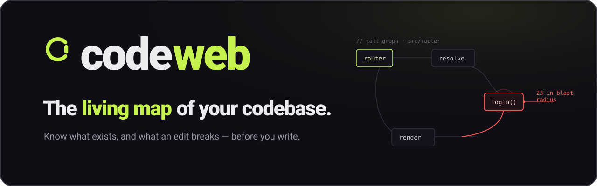
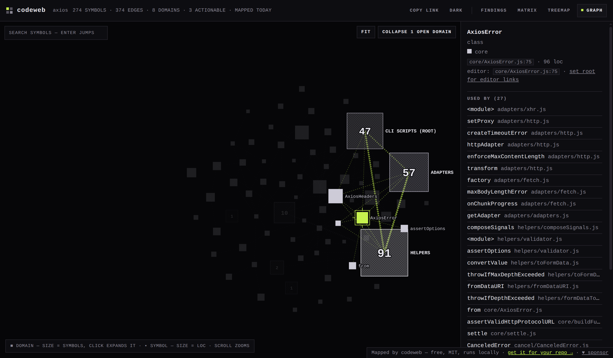
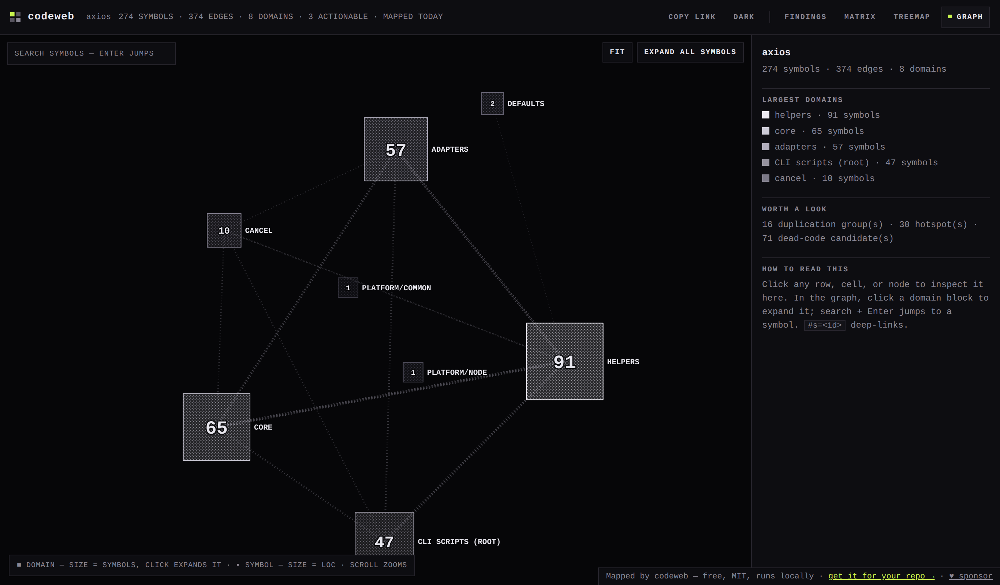
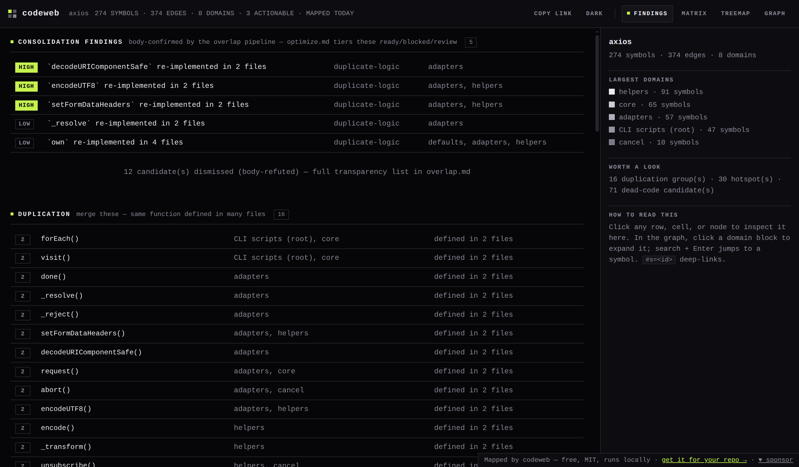
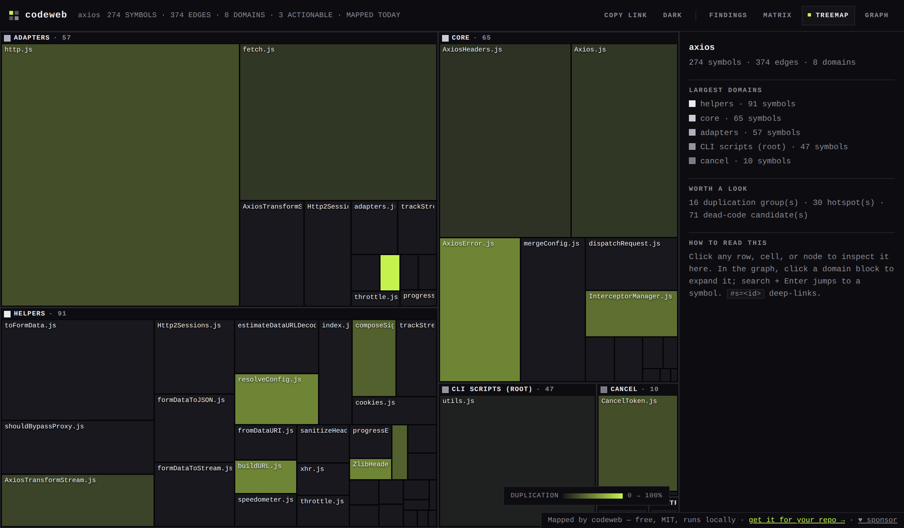
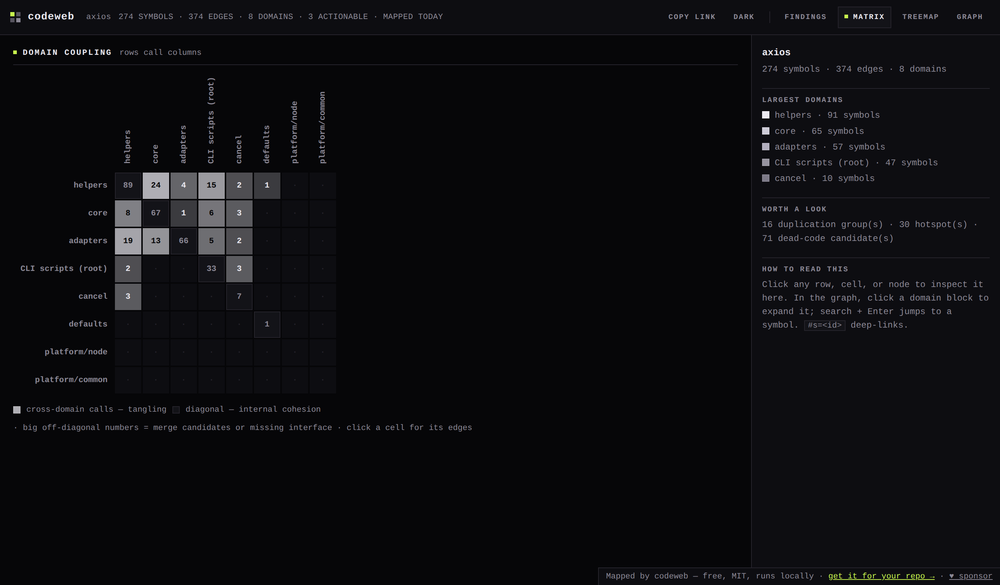
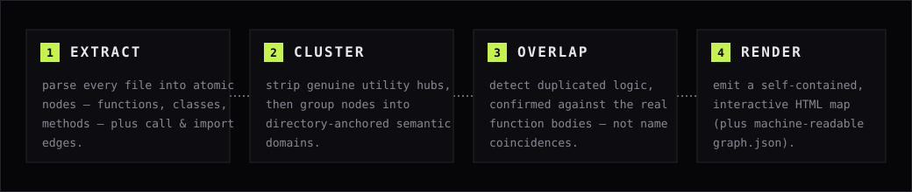

<div align="center">



[](https://github.com/GhostlyGawd/codeweb/actions/workflows/ci.yml)
[](https://www.npmjs.com/package/@ghostlygawd/codeweb)
[](LICENSE)
[](#how-it-works)
[](#use-it-as-an-mcp-tool)
[](https://github.com/sponsors/GhostlyGawd)

**Your coding agents grep. codeweb knows.**

**Free & MIT-licensed. Runs entirely on your machine — no account, no server, no telemetry. Reads your code; never executes it.**
<br><sub>DETERMINISTIC · READ-ONLY · ZERO-DEPENDENCY</sub>

Before you change code, you need answers. **Who calls this? What breaks if I touch it?
Does this already exist? Is this dead?**

Today your coding agents answer by grepping whole files. Thousands of tokens per question, and
they still guess.

codeweb reads your repo once and builds the real call/import graph (~3 s for 3,000 symbols).
After that, every answer is exact, instant, and about a kilobyte.

Your agents get **27 deterministic tools** over MCP — the protocol Claude Code, Cursor, and
Windsurf use to call tools. You get an **interactive map**. No LLM anywhere in codeweb's loop.

The result: your agents break less code, and they stop rewriting functions you already have.

Here's codeweb against grep on [vite](https://github.com/vitejs/vite) (3,000+ symbols), with the
TypeScript compiler as an independent referee ([the receipt](bench/results/oracle-ab.json)):

| The question | codeweb | grep |
|---|---|---|
| *"Who depends on X?"* | Every file the compiler confirms. Fewer wrong matches. **0.7 KB, one call.** | The same files at 3× the tokens — raw text agents must still read |
| *"What breaks if I change X?"* | **One ~1 KB answer** | No transitive search exists: ~5 rounds of grepping, **126× the tokens** |
| *"Does this already exist? Is this dead? Did my edit break structure?"* | One call each (`find_similar` / `deadcode` / `diff` gate) | Not answerable by search |

Run the same referee on your own repo: `npm run bench -- <path>/.codeweb/graph.json`.

The map also shows things you can't see from inside one file: **duplicated logic, dead code,
hotspots, and tangled domains**.

**[Website](https://ghostlygawd.github.io/codeweb/)**&nbsp;·&nbsp;[See it in action](#see-it-in-action)&nbsp;·&nbsp;[Install](#install)&nbsp;·&nbsp;[Use](#use)&nbsp;·&nbsp;[For agents (MCP)](#use-it-as-an-mcp-tool)&nbsp;·&nbsp;[How it works](#how-it-works)&nbsp;·&nbsp;[Changelog](CHANGELOG.md)

</div>

---

## See it in action

One command builds the map: `<target>/.codeweb/report.html`.

Every screenshot below is a real generated report. The target is
**[axios](https://github.com/axios/axios)**: 274 symbols, 8 domains. No mockups.

> **▶ [Read the axios case study](docs/case-study-axios.md).** codeweb found **3 real
> duplications** in axios — a library downloaded 50M times a week. It dismissed 12 false
> positives. Each finding came with a safe merge plan.
> Or **[explore the live map](https://ghostlygawd.github.io/codeweb/demo/)** yourself.

### Know what an edit breaks — before you write

That's the whole point. Click any function in the
[living map](https://ghostlygawd.github.io/codeweb/) and its **blast radius** lights up:
everything your change would touch.

Your agents get the same answer over MCP (`codeweb_impact`) — before they write a line.

<div align="center">

<br><sub>Selecting <code>AxiosError</code> in axios lights up its <b>58 users across the domains that depend on it</b> — try it yourself in the <a href="https://ghostlygawd.github.io/codeweb/">living map</a>.</sub>
</div>

### Navigate the whole system

A force-directed map of every symbol, collapsible to domains. Search, drag, zoom, and click any
node to trace what depends on it and what it reaches.



### Findings — stop guessing what to refactor

Ranked **duplication** (the same function defined across many files), the most depended-on
**hotspots** to change with care, and likely-**dead code** — every row clickable to inspect what
calls it and what it calls.



### See duplication density, and where domains tangle

<table>
<tr>
<td width="50%" valign="top">

<br><b>Treemap</b> — every file sized by lines of code; the brighter red a block, the more of it
is duplicated. The bright blocks are your consolidation targets, at a glance.
</td>
<td width="50%" valign="top">

<br><b>Matrix</b> — domain-to-domain coupling. A big off-diagonal cell means two domains are
tangled: merge them, or put a clean interface between them.
</td>
</tr>
</table>

<div align="center">

<br><sub>The deterministic pipeline, looping: extract → cluster → overlap → render.</sub>
</div>

---

codeweb works at **symbol resolution** — functions, classes, and methods, and the call/import
edges between them. File-level scanners can tell you two *modules* look alike; codeweb tells you
two *functions* are the same work, who calls each, and what merging them would break.

## Proven effective — measured, not just claimed

We wrote down 33 checks **before** testing, so we couldn't move the goalposts. Then we tested
them against independent referees. **32 of 33 passed**
([the check-by-check receipt](bench/preregistration.md)). The short version:

- **Is it right?** We compared its answers to independent referees **490,000+ times.
  Zero disagreements.** All 20,000 edit-safety trials passed.
- **Does it find real duplication?** It caught **every planted clone, zero false alarms**.
  Renamed copies too — text-matching tools catch none of those.
  Receipts: F1 1.0, MRR 0.99.
- **Does it scale?** A repo **twice the size took ~26% longer** to map.
  Queries answer in **a tenth of a second** on 3,000+ symbols.
- **Does it actually help agents?** Agents must find a function's callers before changing it.
  With grep they found **44%**. With codeweb, **74%** — same context budget, all 5 runs
  ([receipt](bench/experiments/efficiency-pilot.reps5-v090.json)).
  **Your agents break code they don't see.**
- **Where does it fall short?** Re-mapping after heavy edits is slower than we want.
  On simple tasks, agents did fine without codeweb.
  Both results are published, not buried.

> **▶ Every number above has a receipt — see the [evidence ledger](https://ghostlygawd.github.io/codeweb/research.html).**
> Raw results live in [`bench/`](bench/); every number regenerates with `node bench/run-all.mjs`.
> CI re-measures the standing performance budgets on every PR
> ([`bench/budgets.json`](bench/budgets.json)) — a change that breaks a published number fails
> the build.

The value codeweb delivers during real work is counted where it accrues: a strictly-local outcome
ledger (`npm run stats`, surfaced in every session brief) prints a receipt shaped like:

```
codeweb this month: 41 pre-edit card(s) · 5 card-named caller(s) followed · 2 regression(s) flagged · 120 queries served
```

## Two modes

- **Internal** — map your own codebase and find consolidation opportunities to restructure.
- **External** — clone a third-party repo *read-only* (e.g. a Claude Code plugin you found on
  GitHub), fully map it, and get an adoption review before you commit to using it. codeweb
  never executes target code.

## Install

**Free & MIT-licensed. Runs entirely on your machine — no account, no server, no telemetry. Reads
your code; never executes it.**

- Requires **Node.js ≥ 22**. That's it.
- Zero required dependencies — runs on an empty `node_modules`, CI-verified.
- One *optional* wasm grammar (`web-tree-sitter`) sharpens extraction. Never required.
- Releases publish from CI with **npm provenance**. Verify with `npm audit signatures`.

**Using Claude Code?** The plugin adds the `/codeweb` command, ambient pre-edit impact cards, and
all 27 tools:
```
/plugin marketplace add GhostlyGawd/codeweb
/plugin install codeweb
```
Then restart Claude Code so the `/codeweb` command, agents, and skill register.

**Using Cursor, Windsurf, or another MCP agent?** Register the same zero-dependency stdio server
(shown with Claude Code's syntax — swap in your client's add-server command):
```
claude mcp add codeweb -- npx -y -p @ghostlygawd/codeweb codeweb-mcp
```

**Just want the map — no AI involved?** One command, from your project directory:
```
cd your-project
npx -y @ghostlygawd/codeweb .    # ~3 s for 3,000 symbols — then open .codeweb/report.html
```

*Not sure? Run the npx one-liner — it's the whole map, no install, nothing to undo.*

**Or run the engine from a clone:**
```
git clone https://github.com/GhostlyGawd/codeweb.git
node codeweb/scripts/run.mjs /path/to/your/project   # map lands in /path/to/your/project/.codeweb
# no-stakes test drive: point it at any repo you already have checked out (read-only, seconds):
node codeweb/scripts/run.mjs /path/to/any/checkout --out-dir /tmp/test-map
# (the bench corpus is NOT bundled — bench/corpus/clone-corpus.sh fetches it, for benchmark work)
```

Requires **Node.js ≥ 22**. The whole pipeline runs on Node with no external dependencies.

Every bin, flag, environment variable, and exit code is tabled in [`docs/cli.md`](docs/cli.md).
Optional tools (ctags, ripgrep) only sharpen the agent fallback path — the default engine reads
the code directly.

**In your editor:** [`editor/vscode-codeweb`](editor/vscode-codeweb/) is a zero-dependency VS Code
extension that shows **`N callers · blast M`** CodeLens above every mapped symbol (served from the
nearest `.codeweb/graph.json`, same numbers as `codeweb_callers`/`codeweb_impact`), with
click-through into the interactive report.

## What you can do — three jobs

Everything below serves one of three jobs. Skim for yours; each section carries the full flags.

- **Know before you edit** — who calls this, what breaks, does this already exist: `impact`,
  `context-pack`, `find`, `find-similar`, and the ambient pre-edit card.
- **Gate every edit** — the structural regression verdict on edits, PRs, and architecture rules:
  `diff`, `ci-gate`, `review`, `fitness`, and the post-edit hook.
- **Clean up, ranked** — consolidation and dead-code work ordered by evidence: `optimize`,
  `deadcode`, `hotspots`, `campaign`, `trend`.

## Use

```
/codeweb                                  # map the current project
/codeweb src/payments --depth symbol      # deep-dive one subsystem
/codeweb https://github.com/owner/repo    # external review before adopting
/codeweb owner/repo --open                # clone, map, and open the report
```

Flags: `--depth module|symbol|auto`, `--engine hybrid|read|tools`, `--focus <glob>`,
`--mode internal|external`, `--open`. See `commands/codeweb.md`.

## Outputs (under `<target>/.codeweb/`)

| File | What it is |
|---|---|
| `graph.json` | The machine-readable web: `nodes`, `edges`, `domains`, `overlaps`, plus `meta` (target root, engine, languages, stats). |
| `report.html` | Self-contained interactive map — force-directed graph, domain tree, clickable node details, ranked overlap tab. No network/CDN required. |
| `report.md` | The same map as plain markdown — domains, top nodes, ranked overlaps. |
| `overlap.md` | The ranked consolidation opportunities in plain markdown. |
| `optimize.md` | The consolidation advisory — duplicate-logic findings tiered **ready / blocked / review**, each pre-flighted against the gate's cycle check (the `optimize.mjs` report). |
| `fragment.json` | The raw extractor output (atomic nodes + edges) before clustering — the pipeline's first stage. |

## Query the graph (for agents & humans)

Once `graph.json` exists, `scripts/query.mjs` answers the structural questions agents need
before they edit — read-only, deterministic, no LLM in the loop:

```
node scripts/query.mjs <graph.json> --impact  <symbol>   # blast radius: transitive callers + domains touched
node scripts/query.mjs <graph.json> --callers <symbol>   # direct callers
node scripts/query.mjs <graph.json> --callees <symbol>   # direct callees
node scripts/query.mjs <graph.json> --cycles             # file-level dependency cycles (SCCs)
node scripts/query.mjs <graph.json> --orphans            # uncalled & unexported (dead-code candidates)
```

`<symbol>` is a node id (`file:label`) or a bare label. A label matching several nodes operates
on the union. Add `--json` for machine-readable output.

Exit codes: `0` success, `1` symbol not found, `2` usage/IO error. Example:

```
$ node scripts/query.mjs .codeweb/graph.json --impact lib/state-store/index.js:get
impact of lib/state-store/index.js:get: 120 functions across 12 domains
```

> `--orphans` is a *candidate* list: codeweb prefers a missing edge to an invented one, so
> genuinely-called functions and entrypoints can surface here — cross-check before deleting.

## Guard agent edits (`diff`)

`scripts/diff.mjs` compares two `graph.json` snapshots (before vs after an edit) and flags
structural **regressions**, so it can run as a PostToolUse hook or CI gate:

```
node scripts/diff.mjs <before.json> <after.json> [--json]
```

The verdict:

- **Exits 1** on a new cycle, a new duplication, or a symbol that loses all its callers.
- **Exits 0** on pure removals. Deleting code is an improvement, not a regression.
- A brand-new uncalled function never trips it — agents add functions before wiring them up.

## Gate every PR (GitHub Action)

`scripts/ci-gate.mjs` runs the same verdict on every pull request. It maps the PR base and head,
then **fails the build on a structural regression**.

Drop it into any repo (full spec: [`docs/ci-gate.md`](docs/ci-gate.md)):

```yaml
# .github/workflows/codeweb-gate.yml
on: pull_request
jobs:
  gate:
    runs-on: ubuntu-latest
    steps:
      - uses: actions/checkout@v4
        with: { fetch-depth: 0 }   # required — the gate diffs against the PR base
      - uses: GhostlyGawd/codeweb/.github/actions/codeweb-gate@main
        with: { target: src, comment: true }   # comment posts the structural review on the PR
```

Locally: `node scripts/ci-gate.mjs --base <ref> [--target <subdir>]`. Pure removals never trip the
gate; a brand-new uncalled function is reported but doesn't fail the build.

## Advise consolidations (`optimize.mjs`)

Where `diff.mjs` *gates* (pass/fail on an edit), `optimize.mjs` *advises*: it reads a graph's
body-confirmed `overlaps[]` and ranks the `duplicate-logic` findings into consolidation
opportunities, **pre-flighting each proposed merge against the gate's own cycle check** — without
editing a line of source.

```
node scripts/optimize.mjs <graph.json> [--json]   # or set CODEWEB_WS
```

Each opportunity lands in one of three tiers:

- **ready** — the copies match, and the simulated merge passes the gate. Safe to apply.
- **blocked** — the naive merge would create a new dependency cycle. Needs a neutral home first.
- **review** — the copies have drifted, or confidence is structural-only. A human (or agent) decides.

For each merge it names the surviving copy and reports what gets removed, which callers get
rewired, and the lines reclaimed. It is **advisory only** — it never writes code; applying the
merge stays a human + gate decision.

## Track duplication over time (`trend.mjs`)

A one-shot map tells you where you are; `trend.mjs` tells you which way you're heading — is the
codebase consolidating or sprawling? It charts **body-confirmed duplication** and **cross-domain
coupling** across snapshots, with a sparkline and a rising/falling verdict:

```
node scripts/trend.mjs --git <repo> --last 10 [--focus <subdir>] [--json]   # snapshot the last N commits
node scripts/trend.mjs a.json b.json c.json [--labels …] [--json]           # or chart pre-built snapshots
```

`--git` maps each of the last N commits in an ephemeral worktree. Your working tree stays
untouched. Watch duplication trend down as you consolidate — or catch it creeping up in review.

## Find the hotspots — where to refactor first (`hotspots.mjs`)

In a large repo the first question is *where do I even start?* `hotspots.mjs` ranks every symbol by
**complexity × fan-in × churn** — the riskiest, most-depended-on, most-churned code first.
Complexity comes free from the body scan; churn is optional (`--git`, or `--churn <map.json>`).

```
$ node scripts/hotspots.mjs <graph.json>
codeweb hotspots: axios/lib — 253 symbol(s) ranked by complexity x fan-in x churn
  weights: complexity 0.5, fanIn 0.3, churn 0.2
  0.533  adapters/fetch.js:factory  [cx 147 in 1 churn 0]
  0.347  adapters/http.js:httpAdapter  [cx 102 in 0 churn 0]
  0.312  core/mergeConfig.js:mergeConfig  [cx 33 in 6 churn 0]
  0.270  helpers/toFormData.js:toFormData  [cx 50 in 3 churn 0]
```

Every row shows its raw components, so the ranking is auditable rather than a black box. Add `--json`
for machine output; also surfaced as the `codeweb_hotspots` MCP tool.

## Plan a whole optimization campaign (`campaign.mjs`)

`campaign.mjs` composes the three advisors — `optimize`, `deadcode`, `break-cycles` — into **one
ordered, ROI-ranked worklist**. Applying the steps in order never introduces a new cycle.

The plan is read-only. codeweb never writes source; your agents (plus the gate) execute each step.

```
$ node scripts/campaign.mjs <graph.json>
codeweb campaign: axios/lib — 80 step(s): 2 cut, 77 delete, 1 merge
  projected: -12 LOC, 2 cycle(s) broken (all steps stay gate-green in order)
  [DELETE] adapters/fetch.js:duplex  (roi 0; +0 LOC, +0 cycle; cumulative -0 LOC)
  …each of 80 steps tagged [CUT|DELETE|MERGE] with its own gate verdict + cumulative delta
```

`--budget N` keeps the top-N ROI prefix; `--json` emits per-step `{op, gate:{ok}, delta, cumulative,
roi}`. Also surfaced as `codeweb_campaign`.

## Onboard in dependency order (`reading-order.mjs`)

To understand a codebase — or one domain — fast, `reading-order.mjs` emits a **foundations-first**
reading path: the depended-upon leaves before the orchestrators that call them, bounded to a budget.
A curated tour instead of blind grep.

```
$ node scripts/reading-order.mjs <graph.json> --budget 6
codeweb reading-order: 6 symbol(s) — read top-down (foundations first):
    1. core/AxiosError.js:AxiosError
        foundation — 18 in-scope caller(s)
    2. cancel/CanceledError.js:CanceledError
        foundation — 5 in-scope caller(s)
    …
```

Scope it with `--scope domain|file|symbol <value>`; cycles degrade gracefully (members ordered by
fan-in, never a crash). Deterministic and read-only; also the `codeweb_reading_order` MCP tool.

## Measured coverage — "is this symbol actually tested?" (`coverage.mjs`)

`codeweb_tests` answers from test-kind call edges (a heuristic). Feed codeweb a real coverage
report and the answers become **measured**:

```
node --test --experimental-test-coverage --test-reporter=lcov > lcov.info   # Node's own runner
node scripts/coverage.mjs .codeweb/graph.json lcov.info                      # or a c8/istanbul JSON
```

Every instrumented symbol gets `covered`/`hits` facts. Query answers then say `covered by the
recorded run` — or, the loud one, `⚠ NOT covered by the recorded test run` — before agents edit
an unguarded symbol.

The feature is optional. Without a coverage input, graphs are byte-identical to before.

## Agent tools — context & pre-flight (`context-pack`, `simulate-edit`)

Two read-only tools that move work off the LLM and into the graph (full spec:
[`docs/agent-tools.md`](docs/agent-tools.md)):

```
node scripts/context-pack.mjs  <graph.json> <symbol> [--json]   # minimal context to edit <symbol>
node scripts/simulate-edit.mjs <graph.json> --delete <sym> | --merge <a,b> [--into <id>] | --move <sym> --to <file>
```

`context-pack` returns everything agents need to edit one symbol: its body, its callers with call
sites, its callees, and the impact set. Agents work from a small window instead of whole files.

`simulate-edit` predicts the gate's verdict for a delete, merge, or move **without performing
it**. Doomed edits get discarded before any code is written.

Both share `optimize.mjs`'s graph primitives, pinned by property tests.

## Agent capability suite (write · review · optimize)

A set of read-only, deterministic tools that make agents better at the three jobs — each pinned by
property tests against an independent reference implementation
(full spec: [`docs/agent-tools-v2.md`](docs/agent-tools-v2.md)):

| Tool | Job | What it answers |
|---|---|---|
| `find-similar.mjs <graph> --body/--stdin/--signature [--structural]` | **write** | "Does code like this already exist?" — ranks existing bodies by similarity to a candidate; `--structural` also catches renamed (Type-2) clones. Reuse instead of re-implementing. |
| `placement.mjs <graph> --calls <ids>` | **write** | Where a new symbol belongs (domain + file by callee gravity) and whether it duplicates something. |
| `query.mjs <graph> --tests <symbol>` | **write** | The tests that exercise a symbol — run the right subset after an edit. |
| `review.mjs <graph> --changed <files> [--before g] [--gate]` | **review** | Maps a change to its changed symbols, blast radius, domains, and a fan-in-ranked review order; structural regression gate. |
| `fitness.mjs <graph> --rules codeweb.rules.json` | **review** | Checks architectural invariants (forbidden deps, layering, no-cycles, fan-in/loc caps); fails on violation. |
| `risk.mjs <graph> [--changed] [--churn/--git]` | **review** | Ranks symbols by change-risk (fan-in × fan-out × loc × blast × churn) for triage. |
| `codemod.mjs <graph> --merge <ids> --into <id> [--write]` | **optimize** | Plans a consolidation merge (deletions + caller rewrites + projected gate); `--write` applies it, gated + reversible. |
| `break-cycles.mjs <graph>` | **optimize** | For each dependency cycle, the cheapest edge to sever — *verified* to break it. |
| `deadcode.mjs <graph>` | **optimize** | Tiers orphans into safe-to-delete vs review-first (test-guarded / entrypoint-like). |
| `annotate.mjs --suppress <fingerprint> [--note …]` | **review** | Records a false-positive suppression in `.codeweb/annotations.json` (never touches source); `overlap`/`deadcode` then hide that finding and report a `suppressedCount`. Fingerprints are identity-based, so a genuinely *new* issue can't hide behind an old suppression. |

Plus **graph freshness**: `refresh.mjs` re-extracts from disk, so mid-edit queries stay accurate.
The cache re-scans only changed files. Test-file edges carry a distinct `test` kind, so
production `--callers` answers exclude tests.

All of the above is also exposed over MCP (below).

## Use it as an MCP tool

`scripts/mcp-server.mjs` is a zero-dependency MCP (Model Context Protocol) stdio server exposing
all **27** of codeweb's tools to any MCP client. In the order your agents meet them:

- **Orient** — `codeweb_map` builds the graph; `codeweb_brief` is the day-one repo page (call it
  first); `codeweb_find` turns free text like *"retry backoff"* into ranked starting symbols.
- **Read the structure** — `codeweb_callers`, `callees`, `impact`, `cycles`, `orphans`, `tests`,
  and `explain` (one symbol, everything known about it).
- **Before writing** — `codeweb_find_similar` (does this already exist?), `placement` (where does
  a new symbol belong?), `context` (the minimal window needed to edit a symbol).
- **Gate the edit** — `codeweb_simulate` (the gate's verdict for a delete/merge/move, before any
  edit), then `refresh` + `diff` after it; `review`, `fitness`, and `risk` for PR time.
- **Clean up** — `codeweb_hotspots`, `deadcode`, `break_cycles`, `campaign`, `reading_order`,
  `codemod` (plan-only over MCP — `--write` is not exposed).
- **Housekeeping** — `codeweb_annotate` (false-positive suppressions, kept in a sidecar, never in
  source) and `codeweb_stats` (the local value receipt).

**Installing the plugin registers the server automatically** (`.claude-plugin/plugin.json` carries
the `mcpServers` entry). Standalone — without the plugin — register it from npm (or a clone):

```
claude mcp add codeweb -- npx -y -p @ghostlygawd/codeweb codeweb-mcp
claude mcp add codeweb -- node /abs/path/to/codeweb/scripts/mcp-server.mjs   # clone variant
```

or in an `.mcp.json`:

```json
{ "mcpServers": { "codeweb": { "command": "node", "args": ["/abs/path/to/codeweb/scripts/mcp-server.mjs"] } } }
```

Built for agents, not just reachable by them:

- **`graph` is optional everywhere** — the server finds the nearest `.codeweb/graph.json` on its
  own. No graph yet? The error names `codeweb_map`, which builds one without leaving MCP.
- **Budgeted responses by default** — a one-line summary, the top items, true totals, and
  `more.remaining`. A context answer that weighed ~300 KB now weighs ~10 KB. `full: true`
  overrides.
- **Staleness awareness** — when the graph no longer matches disk, query results say so and point
  at `codeweb_refresh`.
- The handshake carries `instructions` teaching the loop: *context → edit → refresh → diff-gate*.

## How it works

For JavaScript, TypeScript, Python, Rust, Go, Java, C#, Ruby, PHP, Kotlin, and Swift the default is a **deterministic Node pipeline** — one
command, no LLM in the loop, reproducible byte-for-byte. `scripts/run.mjs` chains five stages
into a per-target workspace:

<div align="center">

</div>

1. **Extract** (`extract-symbols.mjs`) — parse every source file into atomic nodes (functions,
   classes, methods) and call/import edges. When a bare call could belong to several definitions,
   codeweb drops the edge rather than fabricate a false hub — it prefers a missing edge to an
   invented one. Per-file caching keeps re-extraction incremental, byte-identical to a full rebuild.
2. **Cluster** (`cluster3.mjs`) — strip genuine utility hubs, then group nodes into
   directory-anchored semantic domains.
3. **Overlap** (`overlap.mjs`) — detect duplicated logic and parallel implementations, then
   confirm each candidate against the real function bodies (token-shingle similarity) so findings
   are body-backed, not name coincidences. A structural pass over identifier-normalized *skeletons*
   also catches renamed (Type-2) clones (`find-similar --structural`).
4. **Render** (`build-report.mjs`) — turn `graph.json` into the self-contained `report.html`
   (and `report.md`).

For languages the extractor can't parse, codeweb **falls back** to the agent path:
`codeweb-dissector` agents extract nodes and edges per subsystem, and `codeweb-domain-mapper`
tags domains and overlaps.

Both paths emit the same `graph.json` schema. In **external** mode, either path appends an
adoption verdict.

## Components

```
codeweb/
├── .claude-plugin/plugin.json
├── commands/codeweb.md              # /codeweb trigger
├── scripts/                         # the deterministic engine (default fast path)
│   ├── run.mjs                      # orchestrator — one command, runs all stages per target
│   ├── extract-symbols.mjs         # stage 1: source -> atomic nodes + edges (JS/TS/Python/Rust/Go)
│   ├── cluster3.mjs                # stage 2: hub-strip + directory-anchored domains
│   ├── overlap.mjs                 # stage 3: body-confirmed duplication/overlap detection
│   ├── build-report.mjs            # stage 4: graph.json -> interactive report.html + report.md
│   ├── report-template.html        # the renderer's self-contained HTML shell
│   ├── query.mjs                   # structural queries (callers/callees/tests/impact/cycles/orphans)
│   ├── diff.mjs                    # graph-delta / post-edit regression gate (before vs after)
│   ├── trend.mjs                   # duplication + coupling over snapshots / git history (dashboard)
│   ├── ci-gate.mjs                 # CI gate: before(base)-vs-after(working tree) diff, exits 1 on regression
│   ├── optimize.mjs                # advise: rank body-confirmed dups into gated consolidation opportunities
│   ├── context-pack.mjs            # agent context: blast-radius-scoped window to edit a symbol
│   ├── simulate-edit.mjs           # agent pre-flight: predict the gate's verdict for delete/merge/move
│   ├── refresh.mjs                 # F0: re-extract a graph's nodes+edges from disk (cached, fast)
│   ├── find-similar.mjs            # F1: rank existing bodies vs a candidate (reuse-at-write-time)
│   ├── placement.mjs               # F2: suggest a new symbol's domain/file + reuse warnings
│   ├── review.mjs                  # F5: structural review of a change (blast radius, regressions)
│   ├── fitness.mjs                 # F6: architectural fitness-rule checker
│   ├── risk.mjs                    # F7: change-risk ranking for review triage
│   ├── codemod.mjs                 # F8: consolidation edit plan (+ gated/reversible --write)
│   ├── deadcode.mjs                # F10: confidence-tiered dead-code workflow
│   ├── break-cycles.mjs            # F9: cheapest verified cut per dependency cycle
│   ├── hotspots.mjs                # rank symbols by complexity x fan-in x churn (where to refactor first)
│   ├── campaign.mjs                # compose optimize+deadcode+break-cycles into one gated ROI worklist
│   ├── reading-order.mjs           # foundations-first reading path for onboarding (bounded by budget)
│   ├── annotate.mjs                # record false-positive suppressions in .codeweb/annotations.json
│   ├── mcp-server.mjs              # MCP stdio server exposing all queries + the capability suite
│   └── lib/
│       ├── graph-ops.mjs           # shared pure graph primitives (index, cycles, orphans, impact, reviewImpact, …)
│       ├── shingles.mjs            # F1: shared token-shingle/jaccard (also used by overlap.mjs)
│       ├── skeleton.mjs            # identifier-normalized skeleton for Type-2 (renamed) clone detection
│       ├── complexity.mjs          # cyclomatic complexity + nesting depth (the hotspot inputs)
│       ├── dup-check.mjs           # incremental duplication check over changed symbols (edit gate)
│       ├── annotations.mjs         # finding fingerprints + false-positive suppression memory
│       ├── hotspots.mjs            # the complexity x fan-in x churn blend (shared with tests)
│       ├── campaign.mjs            # the ordered/gated/ROI campaign planner (pure)
│       ├── reading-order.mjs       # foundations-first DAG linearization
│       └── risk.mjs                # F7: the change-risk formula + weights (one truth)
├── agents/                          # fallback path (unparseable langs / no deterministic engine)
│   ├── codeweb-dissector.md         # atomic dissection (parallel, read-only)
│   └── codeweb-domain-mapper.md     # domain tagging + overlap detection
├── skills/codebase-anatomy/
│   ├── SKILL.md                     # orchestration brain (fast path default, agents fallback)
│   └── references/
│       ├── graph-schema.md
│       ├── overlap-heuristics.md
│       └── engine-detection.md
├── assets/                          # brand art (logo, hero, animated demo) + report screenshots
└── README.md
```

## Roadmap

- **More first-class languages** — eleven native today (JavaScript, TypeScript, Python, **Rust**,
  **Go**, **Java**, **C#**, **Ruby**, **PHP**, **Kotlin**, **Swift**); anything else routes through
  the agent fallback. Dynamic-dispatch AST tiers cover JS/TS, Java, C#, Python, Go, Rust, **Ruby**,
  and **PHP**; Kotlin/Swift dispatch waits on a trusted wasm grammar at our pinned ABI
  (recorded in `scripts/grammars/PROVENANCE.md`).

_Recently shipped: the agent-intelligence suite (**hotspots**, **campaign**, **reading-order**,
Type-2 clone detection, suppression memory — 27 tools today) · a
**[live interactive demo](https://ghostlygawd.github.io/codeweb/demo/)** · Go and Rust on the fast
path · duplication-over-time trend · the one-command CI regression gate + GitHub Action._

## Versioning & releases

codeweb follows [Semantic Versioning](https://semver.org/) and keeps a
[Keep a Changelog](https://keepachangelog.com/)-formatted [`CHANGELOG.md`](CHANGELOG.md). Every
capability, benchmark, and fix is recorded there and ships as a **tagged GitHub release**.

One source of truth keeps it honest: the version lives in `package.json`, the MCP tool count in
`scripts/mcp-server.mjs`. Everything else is derived and verified:

```bash
npm run version-sync        # propagate version + tool count -> plugin.json, SKILL.md, README badge
npm run check-consistency   # fail if any public-facing surface has drifted
npm run build:site          # regenerate the docs/ website (zero-dependency, deterministic)
npm run release -- --minor  # roll the changelog, bump, sync, rebuild; prints the git/tag steps
```

`check-consistency` runs in CI. It gates version strings on every surface, every prose mention of
the tool and language counts, the CHANGELOG entry for the current version, and every evidence
file the ledger cites.

## About

Built by [GhostlyGawd](https://github.com/GhostlyGawd). Much of the code was written with AI
agents; the commit co-author trailers say which. Issues and questions welcome. Security
reporting: [`SECURITY.md`](SECURITY.md).

**Stay current:** codeweb never phones home. To hear about new versions, watch Releases on
GitHub (**Watch → Custom → Releases**).

## Support the project

Everything that runs on your machine is **free forever**. No accounts, no telemetry, no license
keys.

[Sponsorship](https://github.com/sponsors/GhostlyGawd) funds development — mainly the AI bills
from benchmarking, and new language support. Details on the
[support page](https://ghostlygawd.github.io/codeweb/support.html).

**Enterprise support**: email support with an SLA, onboarding help, and priority on feature
requests. **$3–6k/yr**, limited to a few customers. Contact via the GitHub profile.

## Handoffs

codeweb's outputs feed naturally into `refactor-cleaner`, `codebase-onboarding`, and `code-tour`,
if you have them. None are required.

The ideal second step either way: apply the top **ready** merge from `optimize.md`, re-run
codeweb, and watch the findings count drop.
