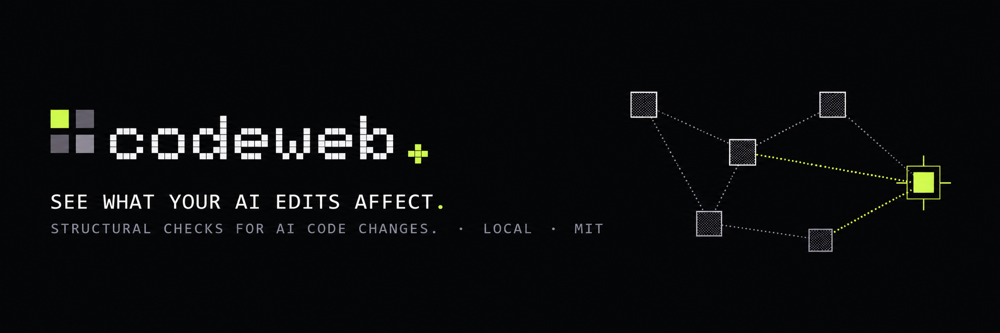
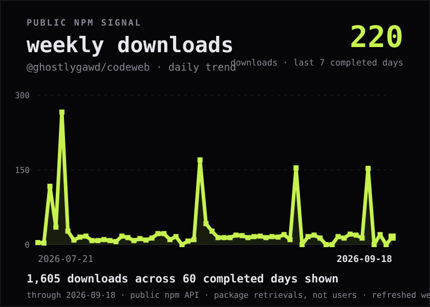
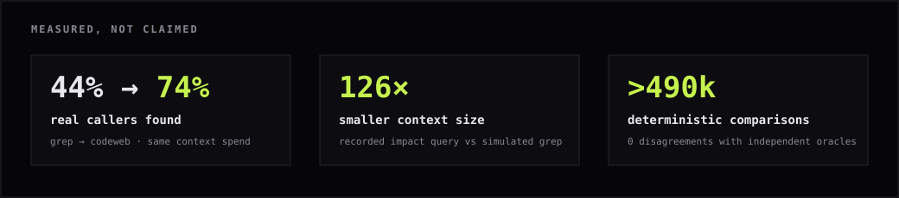
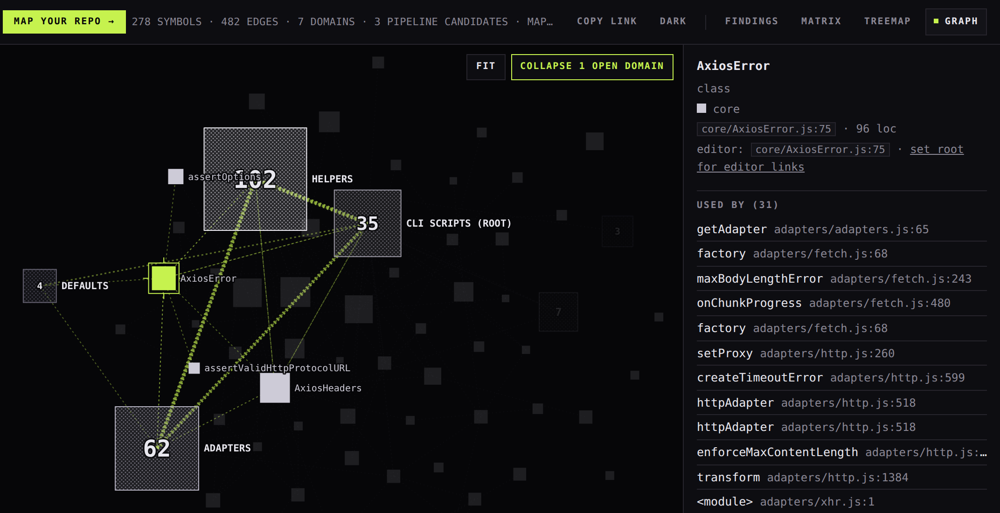
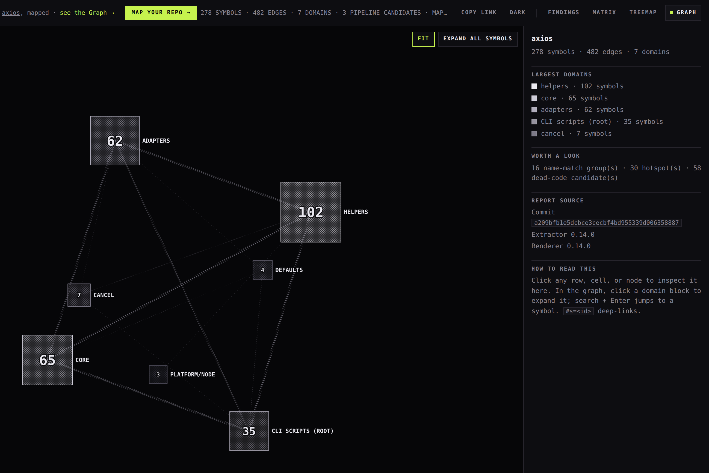
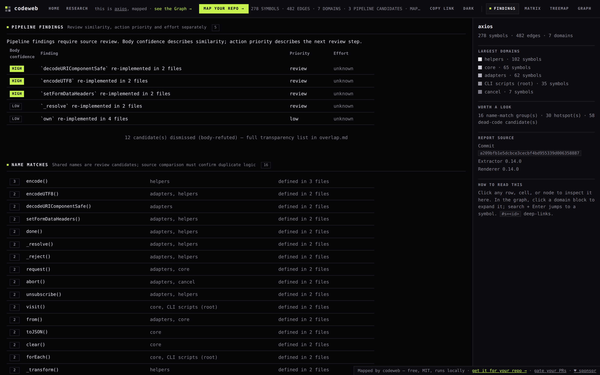
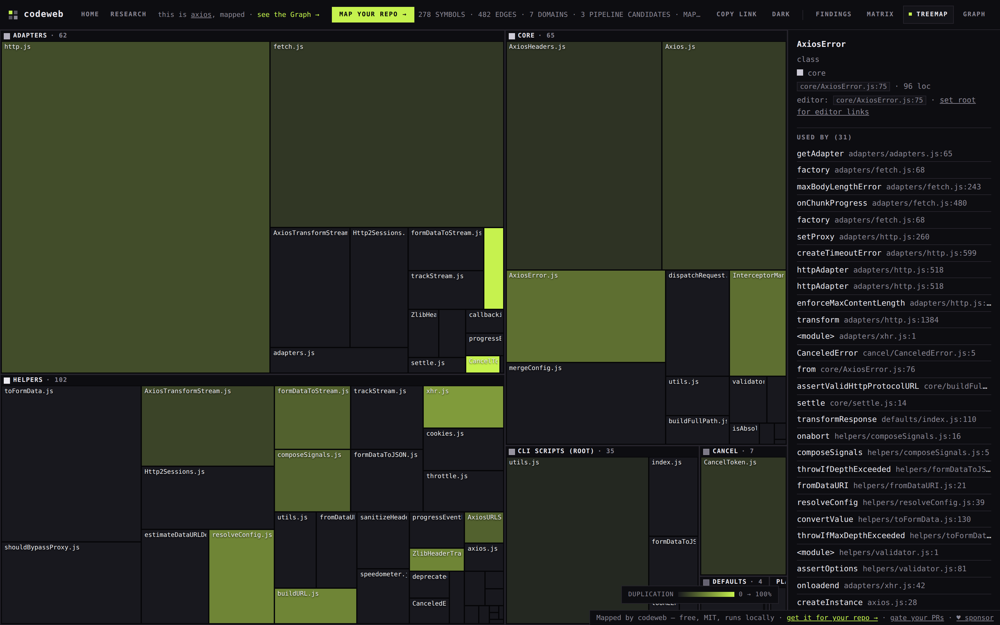
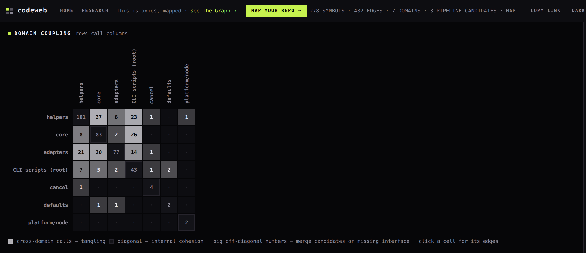

<div align="center">



[](https://github.com/GhostlyGawd/codeweb/actions/workflows/ci.yml)
[](https://www.npmjs.com/package/@ghostlygawd/codeweb)
[](LICENSE)

**Free & MIT-licensed. Runs entirely on your machine — no account, no server, no telemetry. Reads your code; never executes it.**

**[Website](https://ghostlygawd.github.io/codeweb/)**&nbsp;·&nbsp;[See it in action](#see-it-in-action)&nbsp;·&nbsp;[Install](#install)&nbsp;·&nbsp;[Use](#use)&nbsp;·&nbsp;[For agents (MCP: Model Context Protocol)](#use-it-as-an-mcp-tool)&nbsp;·&nbsp;[How it works](#how-it-works)&nbsp;·&nbsp;[Changelog](CHANGELOG.md)

[](#try-it-on-your-repo)
[](https://ghostlygawd.github.io/codeweb/demo/)
[](#install)

</div>

**Your agents break less code and burn fewer tokens.**

<div align="center">
<a href="https://ghostlygawd.github.io/codeweb/downloads.html"></a>
<br><sub>Completed daily downloads from npm's public API. Package downloads are retrievals, not a count of users. Select the chart for the live data and reporting cutoff.</sub>
</div>

codeweb reads your code. It maps each function and the calls between functions. It maps
3,000 symbols in approximately 3 seconds. Static analysis produces the same map from the
same code. No LLM is in the mapping loop.

Your coding agents query the map instead of using grep. In measured tests, agents that used grep
missed more than half of a function's real callers
([see the measurements](https://ghostlygawd.github.io/codeweb/research.html)). An incomplete caller
list can cause an agent to break code that it did not inspect.

- **Give agents structural data:** The Model Context Protocol (MCP) server provides 27 tools,
  including `codeweb_impact`, `codeweb_callers`, and `codeweb_find_similar`.
- **Keep answers small:** Each query returns a bounded structural answer. Your agents can use
  their remaining context for implementation work.
- **Inspect the same data:** The interactive report shows the complete codebase map.

The map also shows relationships that are not visible in one file. These relationships include
**duplicated logic, dead code, hotspots, and tangled domains**.

<div align="center">
<a href="https://ghostlygawd.github.io/codeweb/research.html"></a>
<br><sub>Measured against fixed tasks and independent oracles. Select the proof strip for the methodology and receipts.</sub>
</div>

---

## Try it on your repo

```
cd your-project
npx -y @ghostlygawd/codeweb .
```

For a repository with 3,000 symbols, the first map takes approximately 3 seconds. Open
`.codeweb/report.html` to inspect the map.

## See it in action

Each screenshot below shows a generated report for **axios** (274 symbols and 8 domains).
The screenshots are not mockups.

codeweb found 3 real duplications in axios and rejected 12 false positives. Read
[the case study](docs/case-study-axios.md), or
[inspect the live map](https://ghostlygawd.github.io/codeweb/demo/).

### Know what an edit breaks — before you write

Select a function in the [live map](https://ghostlygawd.github.io/codeweb/). The map highlights
the function's **blast radius** and shows the symbols that the change can affect.

Your agents can get the same answer from the `codeweb_impact` MCP tool before they edit the code.

<div align="center">

<br><sub>Selecting <code>AxiosError</code> in axios lights up its <b>27 callers across the domains that depend on it</b> — try it yourself in the <a href="https://ghostlygawd.github.io/codeweb/">living map</a>.</sub>
</div>

### Navigate the whole system

The force-directed map shows every symbol. You can collapse symbols into domains. Search, drag,
zoom, or select a node to trace its callers and dependencies.



### Findings — stop guessing what to refactor

The Findings tab ranks **duplication**, highly connected **hotspots**, and likely **dead code**.
Select a row to inspect the symbol's callers and dependencies.



### See duplication density, and where domains tangle

<table>
<tr>
<td width="50%" valign="top">

<br><b>Treemap</b> — The size of each block shows the file's lines of code. A brighter block
contains more duplicated code. Use the bright blocks to identify possible consolidation targets.
</td>
<td width="50%" valign="top">

<br><b>Matrix</b> — The matrix shows coupling between domains. A large off-diagonal cell shows
strong coupling. You can merge the domains or add a clear interface between them.
</td>
</tr>
</table>

<div align="center">

<br><sub>The deterministic pipeline, looping: extract → cluster → overlap → render.</sub>
</div>

---

codeweb works at **symbol resolution**. It maps functions, classes, methods, and the call and
import edges between them. A file-level scanner can show that two modules are similar. codeweb
can show that two functions do the same work, identify their callers, and calculate the effect of
a merge.

## Benchmarks

- **Find callers before an edit:** Agents found **74%** of a function's real callers with
  codeweb and **44%** with grep at the same context spend. A missed caller can cause an edit to
  break working code.
- **Calculate the effect of a change:** One codeweb call returned one small answer. Agents that
  used grep needed approximately 5 search rounds and **126 times the tokens**. They still had to
  guess.
- **Detect duplicate code:** codeweb found **every planted duplicate with zero false alarms**,
  including renamed copies. Text search found 0% of the renamed copies.
- **Check deterministic results:** Tests compared codeweb with the TypeScript compiler and other
  independent implementations more than **490,000 times, with zero disagreements**.
- **Map and query quickly:** The first map takes approximately **3 seconds** for a repository with
  3,000 symbols. Queries take approximately **0.1 seconds**. A repository with twice as many
  symbols takes approximately 1.3 times as long to map.
- **Understand the limits:** A new map after a very large edit can take more time. Agents also
  completed simple tasks successfully without codeweb.

Methodology, raw data, and per-claim receipts:
[the evidence ledger](https://ghostlygawd.github.io/codeweb/research.html). Benchmark your own
repo: `npm run bench -- <path>/.codeweb/graph.json`. CI re-runs the performance budgets on
every PR; breaking a published number fails the build.

codeweb also keeps a local activity tally. Run `npm run stats` to see it:

```
codeweb this month: 41 pre-edit card(s) · 5 card-named caller(s) followed · 2 regression(s) flagged · 120 queries served
```

To evaluate a dependency, point codeweb at a repository that you do not own:
`/codeweb https://github.com/owner/repo`. codeweb makes a read-only clone, maps the clone, and
adds an adoption review. codeweb does not execute the target code.

## Install

**Free & MIT-licensed. Runs entirely on your machine — no account, no server, no telemetry. Reads
your code; never executes it.**

- codeweb requires **Node.js ≥ 22**.
- codeweb has zero required dependencies. CI verifies operation with an empty `node_modules`
  directory.
- The optional `web-tree-sitter` wasm grammar improves extraction. codeweb does not require it.
- CI publishes releases with **npm provenance**. Run `npm audit signatures` to verify a release.

**Using Claude Code?** Install the plugin to add the `/codeweb` command, automatic pre-edit
impact cards, and all 27 tools:
```
/plugin marketplace add GhostlyGawd/codeweb
/plugin install codeweb
```
Restart Claude Code to register the `/codeweb` command, agents, and skill.

**Cursor, Windsurf, or another MCP agent:** Register the zero-dependency stdio server. The example
uses Claude Code syntax. Use the equivalent server-registration command for your client:
```
claude mcp add codeweb -- npx -y -p @ghostlygawd/codeweb codeweb-mcp
```

**Map a repository without an AI agent:** Run one command from your project directory:
```
cd your-project
npx -y @ghostlygawd/codeweb .    # ~3 s for 3,000 symbols — then open .codeweb/report.html
```

For a temporary evaluation, use the `npx` command. It creates the map without a permanent
installation.

**Run the engine from a clone:**
```
git clone https://github.com/GhostlyGawd/codeweb.git
node codeweb/scripts/run.mjs /path/to/your/project
```

[`docs/cli.md`](docs/cli.md) lists each executable, flag, and exit code.

**VS Code:** [`editor/vscode-codeweb`](editor/vscode-codeweb/) shows an
**`N callers · blast M`** lens above each mapped symbol. Select the lens to open the report.

## What you can do

Each link lands on full docs, flags, and examples in **[the reference](docs/reference.md)**.

- **Know before you edit:** Find callers, calculate the effect of a change, and check for an
  existing implementation.
  → [Query the graph](docs/reference.md#query-the-graph-for-agents--humans) ·
  [context & pre-flight](docs/reference.md#agent-tools--context--pre-flight-context-pack-simulate-edit)
- **Gate every edit:** Get a structural regression result for an edit, pull request, or
  architecture rule.
  → [The `diff` verdict](docs/reference.md#guard-agent-edits-diff) ·
  [the PR gate](docs/reference.md#gate-every-pr-github-action) ·
  [the capability suite](docs/reference.md#agent-capability-suite-write--review--optimize)
- **Clean up, ranked:** Rank consolidation and dead-code work by evidence.
  → [`optimize`](docs/reference.md#advise-consolidations-optimizemjs) ·
  [`hotspots`](docs/reference.md#find-the-hotspots--where-to-refactor-first-hotspotsmjs) ·
  [`campaign`](docs/reference.md#plan-a-whole-optimization-campaign-campaignmjs) ·
  [`trend`](docs/reference.md#track-duplication-over-time-trendmjs)

## Use

```
/codeweb                                  # map the current project
/codeweb src/payments --depth symbol      # deep-dive one subsystem
/codeweb https://github.com/owner/repo    # external review before adopting
/codeweb owner/repo --open                # clone, map, and open the report
```

Available flags include `--depth module|symbol|auto`, `--engine hybrid|read|tools`,
`--focus <glob>`, `--mode internal|external`, and `--open`. See `commands/codeweb.md` for details.

codeweb writes all outputs to `<target>/.codeweb/`. Agents and other tools can read `graph.json`.
You can open `report.html`. codeweb also creates Markdown versions.
[See the description of each output file.](docs/reference.md#outputs-under-targetcodeweb)

## Use it as an MCP tool

`scripts/mcp-server.mjs` is a zero-dependency Model Context Protocol (MCP) stdio server. It gives
each MCP client access to all **27 tools**. The tools help the client orient, read the structure,
check before writing, gate an edit, and plan cleanup.

**The plugin registers the server automatically.** To register the standalone server, run:

```
claude mcp add codeweb -- npx -y -p @ghostlygawd/codeweb codeweb-mcp
```

The server includes these agent-specific features:

- **Optional `graph` argument:** The server finds the nearest map when you omit `graph`. If no map
  exists, the error directs the agent to `codeweb_map`.
- **Budgeted responses:** Responses include the highest-ranked items and the true totals. A context
  response that was approximately 300 KB is now approximately 10 KB.
- **Staleness information:** A stale result identifies its state and directs the agent to
  `codeweb_refresh`.

[All 27 tools, grouped and explained →](docs/reference.md#the-mcp-server-tool-by-tool)

## How it works

For JavaScript, TypeScript, Python, Rust, Go, Java, C#, Ruby, PHP, Kotlin, and Swift, codeweb uses
a **deterministic Node pipeline** by default. One command creates the map. No LLM is in the
pipeline, and the same input produces the same bytes.

The map pipeline has the four stages in the following diagram. `scripts/run.mjs` also creates
`optimize.md` after overlap analysis and before report rendering.

<div align="center">

</div>

1. **Extract** (`extract-symbols.mjs`) parses each source file into atomic nodes such as functions,
   classes, and methods. It also records call and import edges. If a bare call can refer to more
   than one definition, codeweb omits the edge instead of guessing. Per-file caching makes
   extraction incremental and byte-identical to a full rebuild. An imported `.json` file enters
   the map as a file-level node without being parsed. An unreferenced `.json` file stays out of the
   map, which prevents lock-file noise.
2. **Cluster** (`cluster3.mjs`) removes genuine utility hubs and groups the remaining nodes into
   directory-anchored semantic domains.
3. **Overlap** (`overlap.mjs`) detects duplicated logic and parallel implementations. It compares
   each candidate with the actual function bodies by using token-shingle similarity. This check
   prevents name coincidences from becoming findings. A structural pass over
   identifier-normalized *skeletons* also finds renamed Type-2 clones
   (`find-similar --structural`).
4. **Render** (`build-report.mjs`) converts `graph.json` into the self-contained `report.html` and
   `report.md` files.

For a language that the extractor cannot parse, codeweb **uses the agent path**.
`codeweb-dissector` agents extract nodes and edges for each subsystem. `codeweb-domain-mapper`
then assigns domains and overlaps.

Both paths produce the same `graph.json` schema. In **external** mode, each path also adds an
adoption verdict.

Curious how the repo is laid out? [The component map lives in the
reference.](docs/reference.md#components)

## Roadmap

- **Support more first-class languages:** codeweb currently supports eleven native languages:
  JavaScript, TypeScript, Python, **Rust**, **Go**, **Java**, **C#**, **Ruby**, **PHP**, **Kotlin**,
  and **Swift**. Other languages use the agent fallback. Dynamic-dispatch AST tiers cover JS/TS,
  Java, C#, Python, Go, Rust, **Ruby**, and **PHP**. Kotlin and Swift dispatch requires a trusted
  wasm grammar at the pinned ABI. See `scripts/grammars/PROVENANCE.md`.

_Recent releases added the agent-intelligence suite (**hotspots**, **campaign**,
**reading-order**, Type-2 clone detection, and suppression memory), a
**[live interactive demo](https://ghostlygawd.github.io/codeweb/demo/)**, Go and Rust on the fast
path, duplication trend data, and the one-command CI regression gate with a GitHub Action.
codeweb currently provides 27 tools._

## Versioning & releases

codeweb follows [Semantic Versioning](https://semver.org/). It records changes in
[`CHANGELOG.md`](CHANGELOG.md), which uses the
[Keep a Changelog](https://keepachangelog.com/) format. Each capability, benchmark, and fix ships
in a **tagged GitHub release**.

`package.json` is the source of truth for the version.
`scripts/mcp-server.mjs` is the source of truth for the MCP tool count. The release tools derive
and verify the other values:

```bash
npm run version-sync        # propagate version + tool count -> plugin.json, SKILL.md, README badge
npm run check-consistency   # fail if any public-facing surface has drifted
npm run build:site          # regenerate the docs/ website (zero-dependency, deterministic)
npm run release -- --minor  # roll the changelog, bump, sync, rebuild; prints the git/tag steps
```

`check-consistency` runs in CI. It gates version strings on every surface, every prose mention of
the tool and language counts, the CHANGELOG entry for the current version, and every evidence
file the ledger cites.

## About

Built by [GhostlyGawd](https://github.com/GhostlyGawd). AI agents helped write much of the code.
The commit co-author trailers identify those contributions. Open an issue for questions or
problems. Use [`SECURITY.md`](SECURITY.md) to report a security issue.

**Stay current:** codeweb does not contact an update service. To receive release notifications,
select **Watch → Custom → Releases** on GitHub.

## Support the project

Everything that runs locally is **free forever**. It does not require an account, telemetry, or a
license key.

[Sponsoring](https://github.com/sponsors/GhostlyGawd) supports the project. Sponsorship also
provides advertising. Top sponsors can put their logo at the top of this README, and each sponsor
can join the supporters list. See the
[support page](https://ghostlygawd.github.io/codeweb/support.html) for details.

Running codeweb at an organization and need help? Send email through the GitHub profile.

## Handoffs

You can send codeweb outputs to `refactor-cleaner`, `codebase-onboarding`, or `code-tour` if you
have those tools. codeweb does not require them.

For a useful next step, apply the highest-ranked **ready** merge from `optimize.md`. Then run
codeweb again and compare the findings count.
