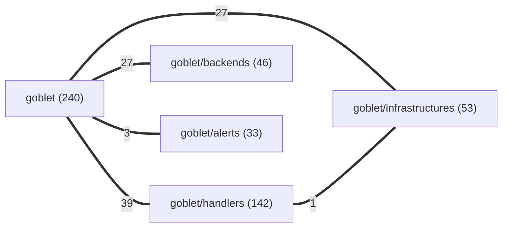

# Case study: codeweb on goblet

We pointed codeweb at [**goblet**](https://github.com/goblet/goblet) — the Python framework for
deploying serverless apps to Google Cloud (Cloud Functions v1/v2, Cloud Run) from decorator-based
Python — read-only, no setup, one command. It never executes target code; it reads the source,
builds the call/import graph, and reports. Here is exactly what it found across the repo.

> **▶ Reproduce it in one command** (see [Reproduce it](#reproduce-it) below) — every artifact
> referenced here regenerates byte-for-byte, no LLM in the loop.

## The map

```
$ node scripts/run.mjs path/to/goblet --target goblet/goblet
[codeweb] 925 nodes, 976 edges, 13 domains, 44 overlaps
```

| | |
|---|---|
| **Symbols** | 925 functions / classes / methods across 77 files |
| **Call + import edges** | 976 |
| **Roles** (auto-tagged) | 531 product · 376 test · 18 example |
| **Domains** (auto-clustered) | `goblet` (core), `goblet/handlers`, `goblet/infrastructures`, `goblet/backends`, `goblet/alerts`, + example/CLI clusters |
| **Overlap candidates** | 44 |
| **Dead-code candidates** | 0 |
| **File-level dependency cycles** | 1 (a 33-file core tangle — see [Architecture signal](#architecture-signal)) |

The domain graph — every edge label is the count of call/import edges crossing between two areas:



`goblet/` core sits at the hub; `handlers` (routes, pubsub, scheduler, eventarc, storage, jobs…),
`infrastructures` (redis, vpcconnector, apigateway, cloudtask…), and `backends` (the three GCP
compute targets) all fan out from it. That is exactly the shape you'd expect from a
decorator-registers-a-handler framework — and codeweb draws it from structure, not a guess.

### Load-bearing symbols — change these with care

The most depended-on symbols (transitive fan-in), i.e. the ones an edit ripples farthest from:

| Symbol | Fan-in | Where |
|---|---|---|
| `Goblet` (the app object) | 202 | `goblet/app.py:23` |
| `GConfig` (config loader) | 37 | `goblet/config.py:10` |
| `gcp_generic_resource_permissions` | 35 | `goblet/permissions.py:8` |
| `VersionedClients` | 30 | `goblet/client.py:41` |
| `Handler` (base handler) | 30 | `goblet/handlers/handler.py:13` |
| `CloudRun` backend | 30 | `goblet/backends/cloudrun.py` |
| `OpenApiSpec` | 29 | `goblet/handlers/routes.py` |

No surprises — the app object, config, the permissions helper, and the client factory are the spine.
If you adopt goblet and need to patch it, these are the symbols to test around.

## The finding that matters — precision, not noise

Anyone can `grep` for same-named functions. The number that counts is what survives a look at the
**actual function bodies**. codeweb confirms each overlap with token-shingle similarity of the real
code and simulates each merge against its own regression gate, so the **44 raw candidates** resolve to:

- **16 interface-pattern groups** — `destroy` (×25), `__init__` (×24), `register` (×19),
  `_deploy` (×18), `__call__` (×13), `deploy` (×9), and 10 more. codeweb recognizes these as a
  **shared framework contract** (every handler/backend/infrastructure implements the same hooks) and
  explicitly says **do not merge them**. This is the trap a naive same-name deduper falls into;
  codeweb doesn't.
- **14 coincidental collisions** — same name, genuinely different bodies (`run`, `write`, `package`,
  `job`, the `client.py`↔`decorators.py` accessor pairs…). Body-**refuted** and dismissed so you
  don't chase them.
- **5 drifted duplications** — real shared logic whose copies have **diverged**. Flagged for human
  judgement, not auto-merged (see [Review tier](#review-tier--diverged-decide-deliberately)).
- **9 body-confirmed duplications** — genuinely the same logic in more than one place. **8 clear the
  "ready" bar** (≥60% body match, not drifted, merge stays acyclic); the 9th (`create_routine_payload`,
  30% match) is held back for review.

That funnel — 44 down to 8 confidently-actionable, with every dismissal *explained* — is the point.
The tool spends its credibility carefully.

## Ready tier — the merges the gate would accept

Body-confirmed, not drifted, and the simulated merge stays acyclic. Applying all eight removes
**8 duplication findings and reclaims ~159 LOC** with the regression gate staying green. Each is a
checklist item, not an auto-edit — codeweb writes no code.

| # | Function | Copies | Body match | Reclaims | Verdict |
|---|---|---|---|---|---|
| ov2 | `set_iam_policy` | `cloudfunctionv1` + `cloudfunctionv2` + `cloudrun` | **81%** (v1≡v2 identical) | ~34 LOC | ✅ Ready |
| ov1 | `_check_or_enable_service` | `backend` + `handler` + `infrastructure` | 73% (handler≡infra identical) | ~8 LOC | ✅ Ready |
| ov7 | `deploy_bigquery_connection` | `bq_remote_function` + `bq_spark_stored_procedure` | 93% | ~33 LOC | ✅ Ready |
| ov9 | `destroy_routine` | `bq_remote_function` + `bq_spark_stored_procedure` | **100%** | ~27 LOC | ✅ Ready |
| ov8 | `destroy_bigquery_connection` | `bq_remote_function` + `bq_spark_stored_procedure` | 87% | ~23 LOC | ✅ Ready |
| ov11 | `_destroy_job` | `jobs` + `scheduler` | 62% | ~16 LOC | ✅ Ready |
| ov6 | `list_uptime_checks` | `alerts` + `uptime` | **100%** | ~9 LOC | ✅ Ready |
| ov10 | `zip_required_files` | `backend` + `cloudrun` | 90% | ~9 LOC | ✅ Ready |

The clearest structural signal here: **`bq_remote_function.py` (a handler) and
`bq_spark_stored_procedure.py` (an infrastructure) share four near-identical BigQuery routines**
(`deploy_bigquery_connection`, `destroy_bigquery_connection`, `destroy_routine`, and the
review-tier `create_routine_payload`). That's a genuine consolidation target — a `bigquery`
shared module both sides import — and it spans two domains, so neither file's author can see it from
inside their own file. This is precisely what codeweb surfaces that grep-from-inside-a-file cannot.

**Spot-checked against source** (the numbers aren't taken on faith):

- `set_iam_policy` — `cloudfunctionv1` and `cloudfunctionv2` are **byte-identical**
  (`roles/cloudfunctions.invoker`); `cloudrun` differs by role (`roles/run.invoker`) and an extra
  `parent_schema`. codeweb's 81%-avg / 72%-min reading is exact.
- `_check_or_enable_service` — `handler` and `infrastructure` are **byte-identical** (both guard on
  `if not self.resources`); `backend`'s copy drops the guard. Matches the 73%-avg / 59%-min reading.
- `list_uptime_checks` — same body in `alerts` and `uptime`, differing only in the display-name
  filter string. Matches the 100% structural reading.

## Review tier — diverged, decide deliberately

Five duplications where the copies have **drifted**. codeweb refuses to auto-merge these — the whole
point is that picking one body silently could ship a behavior change. Read before acting.

| # | Function | Copies | Body match | Note |
|---|---|---|---|---|
| ov4 | `validation_config` | `backend` + `cloudfunctionv2` + `cloudrun` | 40% | Diverged across the 3 backends |
| ov3 | `get_permissions` | `app` + `handler` + `infrastructure` | 38% | `handler`≡`infrastructure`; `app`'s copy differs |
| ov14 | `deploy_job` | `jobs` + `scheduler` | 48% | Sibling handlers, drifted |
| ov13 | `_get_upload_params` | `cloudfunctionv1` + `cloudfunctionv2` | 38% | Drifted between the two function backends |
| ov12 | `skip_deployment` | `backend` + `cloudrun` | 50% | 2-line guard, diverged |

None is **blocked** — codeweb found no merge in this repo that would introduce a new file cycle, so
there's nothing here needing the "host-the-canonical-in-a-neutral-module-first" dance.

## Architecture signal

Two things worth knowing before you adopt or patch goblet:

1. **One 33-file dependency cycle in `goblet/` core.** Nearly the entire package —
   `app.py`, `decorators.py`, all the backends, all the handlers, all the infrastructures,
   `resource_manager.py`, `client.py`, `config.py`, `utils.py` — sits in a single strongly-connected
   component. Import goblet and you import essentially all of it; there's no clean sub-layer you can
   pull in isolation. This is common for a decorator-registry framework (the app knows every handler
   and every handler reaches back to the app), but it means the blast radius of a core edit is the
   whole package, and it's why codeweb marks `Goblet` with a fan-in of 202.

2. **The framework-contract patterns are healthy, not debt.** The 25 `destroy` / 19 `register` /
   18 `_deploy` / 13 `__call__` implementations are the plugin surface — each GCP resource type
   implements the same lifecycle hooks. codeweb correctly declines to flag these as duplication.
   A reviewer skimming a raw same-name report would waste hours "consolidating" them; codeweb saves
   that time by naming the pattern.

**No dead code.** codeweb found **0 orphan candidates** — no uncalled, unexported symbols. For a
15k-LOC framework with a large public surface, that's a clean bill.

## Adoption verdict

goblet is a **well-factored, actively-shaped framework** with a clear domain layering (core →
handlers/backends/infrastructures) and no dead weight. The debt codeweb surfaces is modest and
localized:

- **The real, safe win** is the BigQuery logic shared between `handlers/bq_remote_function.py` and
  `infrastructures/bq_spark_stored_procedure.py` (four routines) — a clean shared-module extraction.
- **The rest of the ready tier** (`set_iam_policy` across backends, `_check_or_enable_service` across
  the three base classes) are small, mechanical, gate-green consolidations.
- **The drifted five** are the ones to watch: `get_permissions`, `validation_config`, and
  `_get_upload_params` have diverged copies, so a bug fixed in one may not be fixed in the others —
  worth reconciling deliberately.
- **The 33-file core cycle** is the one architectural caveat: budget for "an edit to core touches
  everything" if you plan to fork or patch, and lean on goblet's own test suite (376 test symbols)
  as the safety net.

Nothing here is a red flag for *using* goblet; these are notes for anyone who plans to *modify* it.

## Reproduce it

```
git clone https://github.com/goblet/goblet.git
git clone https://github.com/GhostlyGawd/codeweb.git
node codeweb/scripts/run.mjs goblet --target goblet/goblet
# open codeweb/.codeweb/runs/goblet-goblet/report.html · overlap.md · optimize.md
```

The full ranked advisory (8 ready · 0 blocked · 5 review) is in `optimize.md`; the body-confirmed
overlap list — with all 14 dismissals and 16 framework-contract patterns spelled out — is in
`overlap.md`. Both regenerate byte-for-byte on every run.
